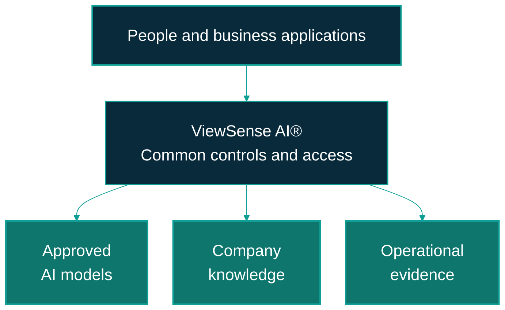

---
hide:
  - toc
---

# Business overview

ViewSense AI® gives an organisation a common control layer for AI models and company knowledge.
Business applications use stable interfaces while the platform team manages approved providers,
access rules, and operational evidence. The aim is to preserve supplier choice and keep decisions
about data and risk with the organisation.

This section is for business sponsors, management, procurement, and risk teams. Start with
[compatibility and product fit](business/compatibility.md), then
[value and use cases](business/value-and-use-cases.md) and
[adoption and governance](business/adoption-and-governance.md).

## Where it fits

The diagram shows the business relationship between applications, the control layer, and approved
resources. Each selected integration must meet the readiness requirements below.

On smaller screens, scroll the diagram horizontally to see all the boxes.

## The management decisions

| Decision | What the organisation controls |
|---|---|
| Where AI runs | The approved deployment location and whether a request may use a local or cloud model. |
| Which knowledge is available | Data ownership, allowed users, permitted purposes, and the information admitted into a pilot. |
| Which suppliers are used | The model, memory, identity, and operational products accepted for the selected application release. |
| Which actions are allowed | Budgets, permissions, and approval requirements; executable business-tool automation remains a planned extension. |
| When to expand | Evidence from quality, cost, security, and operational acceptance. |

## What can be evaluated now

The tested reference includes response orchestration, PostgreSQL/pgvector memory, basic document
ingestion, provider admission checks, safe evidence APIs, and a bounded agent lifecycle with manual
approval and cancellation. Development identity, static certificates, mock models, and mock tools
are test components.

OpenAI, Ollama, Mem0, enterprise identity, and selected operational integrations have documented
integration paths. They require configuration and acceptance in the organisation's environment.
The local Ollama decision and embedding retrieval path has development evidence; that evidence does
not certify an enterprise deployment.

Autonomous business actions, native MCP transport, workflow-engine adapters, and several production
operations capabilities remain planned. The [compatibility guide](business/compatibility.md)
separates these states, and the [implementation conformance map](design/high-level/00-implementation-conformance.md)
records the technical evidence and outstanding gaps.

## A useful first commitment

Choose one knowledge-assistance pilot with a named business owner, approved information, a limited
user group, and human review of answers. Agree success measures and environment acceptance before
connecting sensitive data or expanding the service. The [adoption guide](business/adoption-and-governance.md)
provides the decision gates and responsibilities.

Use the release dropdown to read documentation for the corresponding ViewSense AI® application
version. **Latest (main)** describes ongoing development; release documentation records the selected
baseline. Neither label establishes the acceptance status of a customer installation.
