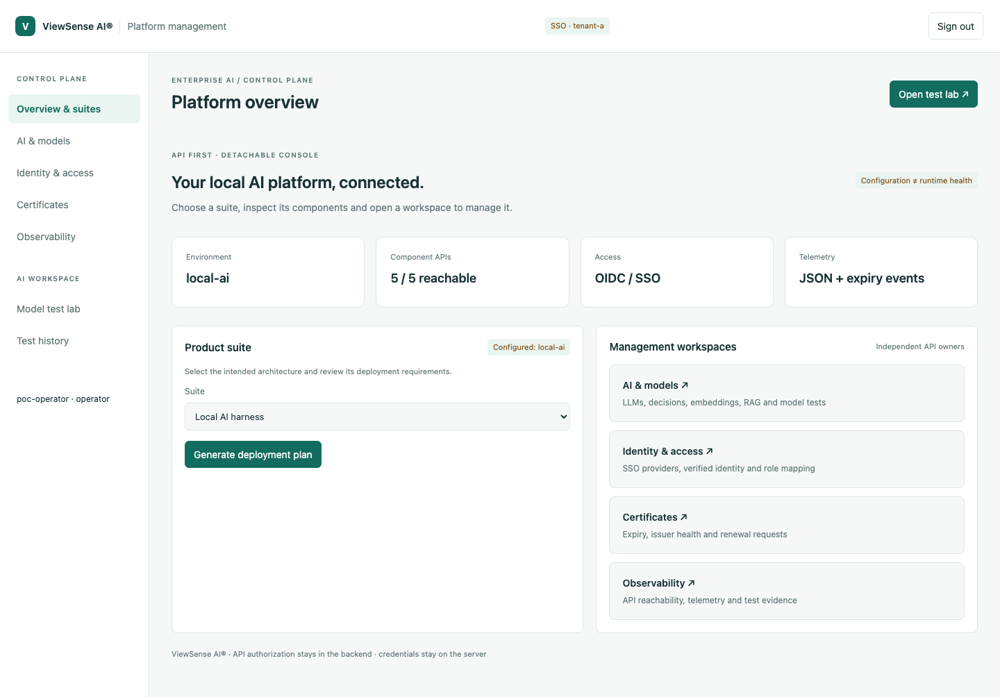
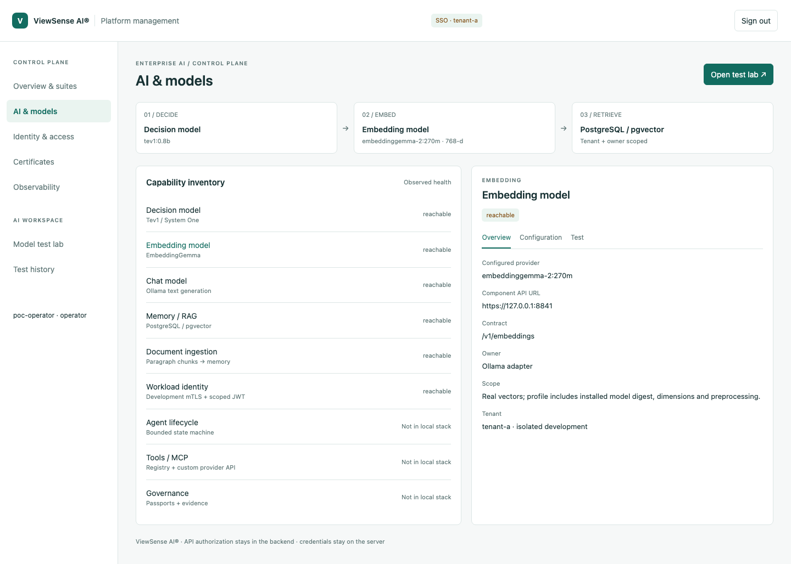
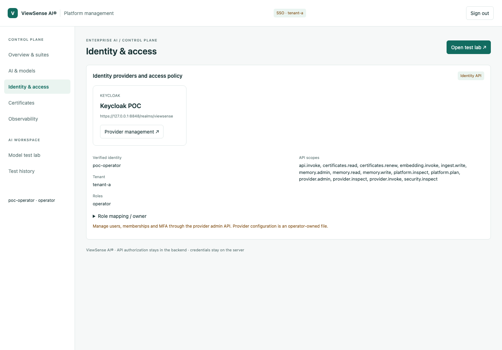
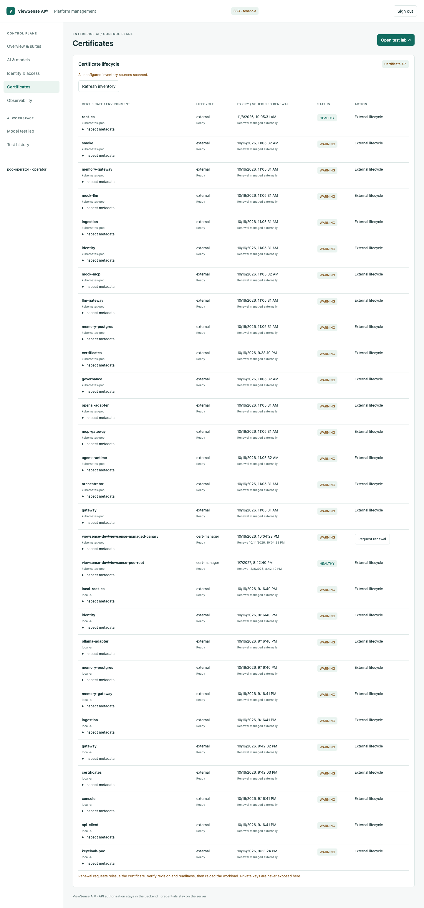
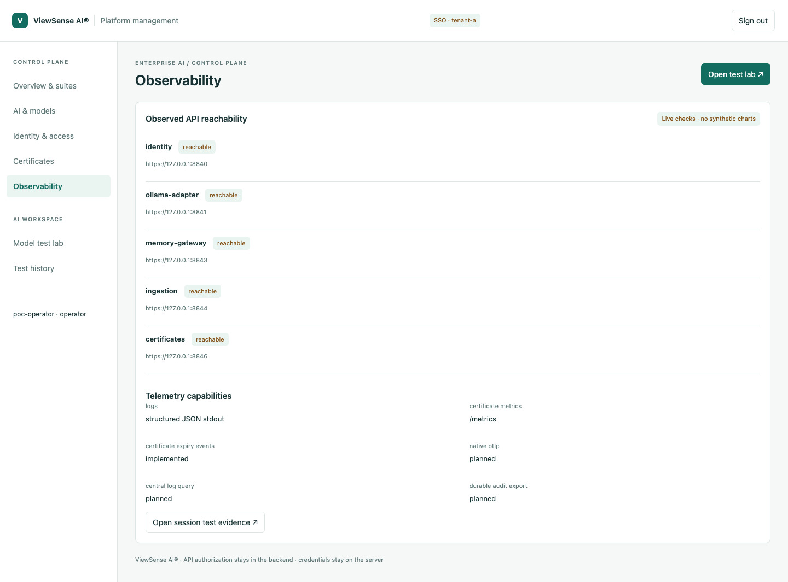
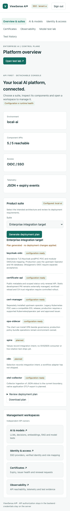

# ViewSense AI® management console POC

Live screenshots captured after browser SSO with the dedicated POC operator account.
They show Overview/suites, AI/models, Identity/access, Certificates, Observability and the responsive
mobile overview. These are runtime screenshots of the detachable client, not static mockups.

Reproduce using `scripts/test-management-browser.py` with Playwright and installed Chromium after
following `deploy/integrations/keycloak.md`. The script checks actual inventory and API permissions,
creates one synthetic RAG memory, checks tenant isolation and captures these pages.

`test-enterprise-poc.py --renew-canary` verified certificate revision 1 → 2, stale request 409 and
root protection 403. Unit tests: 80 passed; lint, profiles, docs and deployment passed. The Kubernetes
application smoke passed; the existing CNI NetworkPolicy denial check failed, blocking production
security acceptance. POC suite selection only produces a plan, and upstream/production gaps remain.

No passwords, bearer tokens, private keys or real customer memory are included.

## Overview and suites

## AI and models

## Identity and access

## Certificates

## Observability

## Mobile overview

