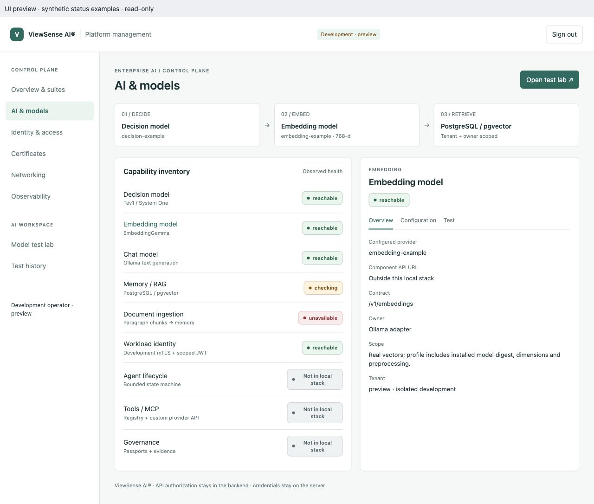
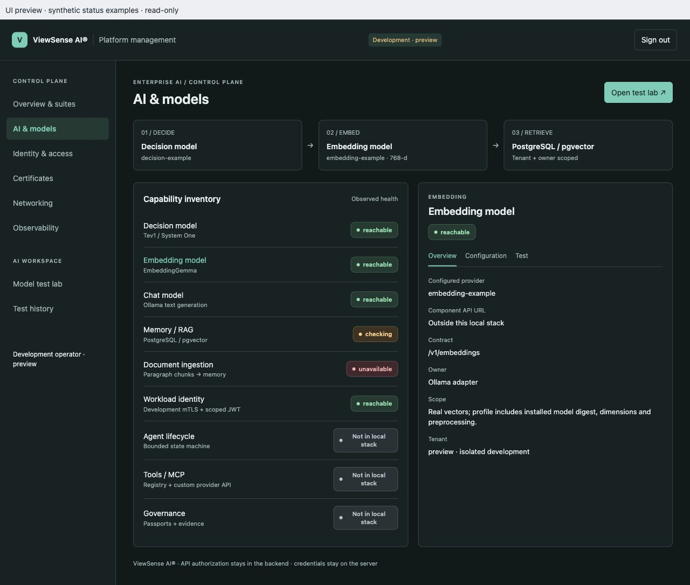
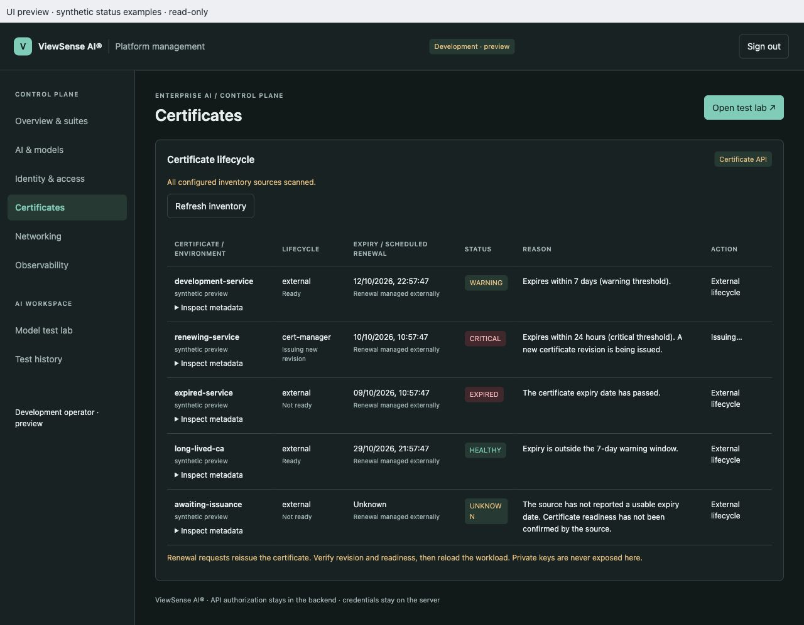

# Health and certificate presentation previews

These previews use the actual management-console UI assets with explicit synthetic
data. They cover health badges, certificate expiry explanations, and light/dark
presentation. They are documentation evidence rather than live installation health.

See the [implementation conformance record](../../design/high-level/00-implementation-conformance.md#health-badges-and-certificate-explanations-minor-presentation-change)
for validation scope and limitations.

## Health states in light mode

## Health states in dark mode

## Certificate explanations in dark mode

