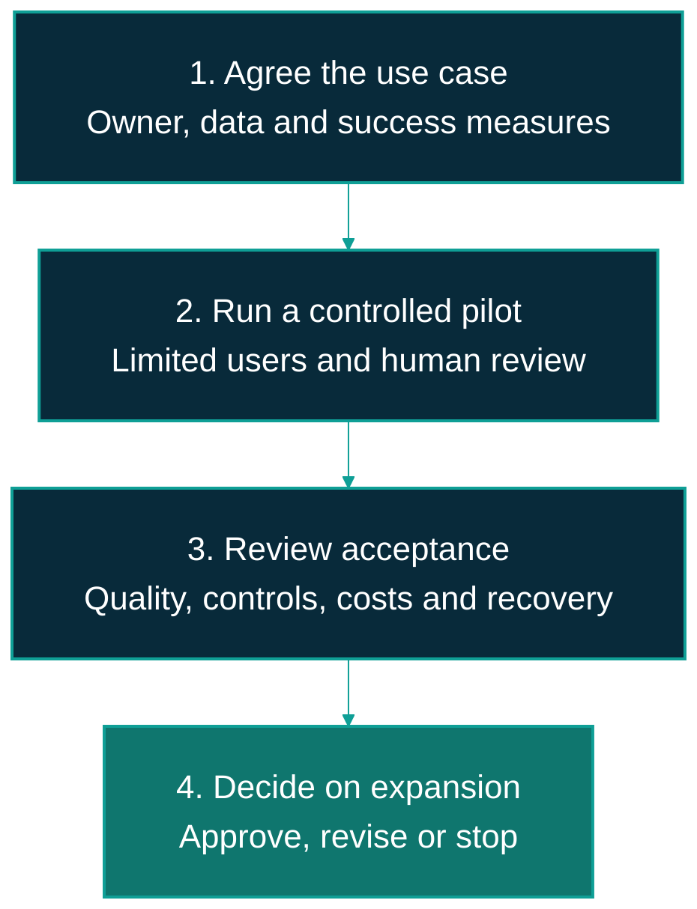

---
hide:
  - toc
---

# Business adoption and governance

Adopt ViewSense AI® through a limited evaluation with explicit business and technical owners.
Approve the use case and data before connecting a real provider, then expand only after the
selected environment meets its acceptance criteria.

## Four decision gates

On smaller screens, scroll the diagram horizontally to see all the boxes.

The diagram is a management process, not an automated platform workflow. A working demonstration
completes part of the pilot; it does not complete security or operational acceptance.

| Gate | Evidence needed for the decision |
|---|---|
| Agree the use case | Named sponsor, users and data owner; allowed purpose; measurable targets; approved product choices and cost boundary. |
| Run the controlled pilot | Matching application/docs baseline; configured integrations; representative test questions; access tests; human review and a stop procedure. |
| Review acceptance | Quality results, supplier and data-flow approvals, enforced isolation, operational monitoring, recovery evidence, and total operating cost. |
| Decide on expansion | Named service owner and support model; recorded acceptance or remaining blockers; rollout, rollback, training, and review arrangements. |

## Who owns what

| Owner | Responsibility |
|---|---|
| Business sponsor | Own the outcome, budget, success measures, and decision to continue or stop. |
| Data owner | Approve information use, permissions, retention, and the removal or correction of unsuitable knowledge. |
| Security and risk | Review identity, data movement, provider admission, isolation evidence, and approval rules. |
| Platform and service owner | Qualify product versions, operate dependencies, monitor the service, and test upgrades, rollback, and recovery. |
| Business reviewers | Assess answer quality, record failures, and decide whether an answer is suitable for use. |
| Procurement and finance | Review supplier terms, support, licences, and the full cost of operation and change. |

## Production acceptance still requires work

The [conformance map](../design/high-level/00-implementation-conformance.md) records an existing
network-isolation failure and incomplete mesh/environment acceptance. High availability and disaster
recovery, production identity/session controls, immutable evidence export, durable telemetry, and
coordinated certificate/trust rotation also have outstanding work. These are explicit blockers or
acceptance requirements to resolve for the intended deployment, not features established by a pilot.

Native MCP and workflow-engine integrations and autonomous execution remain planned. Do not make
them dependencies of a committed business outcome until implementation and acceptance exist.

## Keep the business baseline aligned with releases

Select the docs version that matches the application release. Record that release alongside the
approved upstream versions and acceptance results. Reassess provider compatibility, data access,
quality, and operating procedures when a release or product changes.

**Latest (main)** can include development changes beyond a released application. The
[release publishing guide](../publishing.md#documentation-per-application-release) explains how
the documentation snapshots are retained. Calendar dates are not used as documentation versions.
