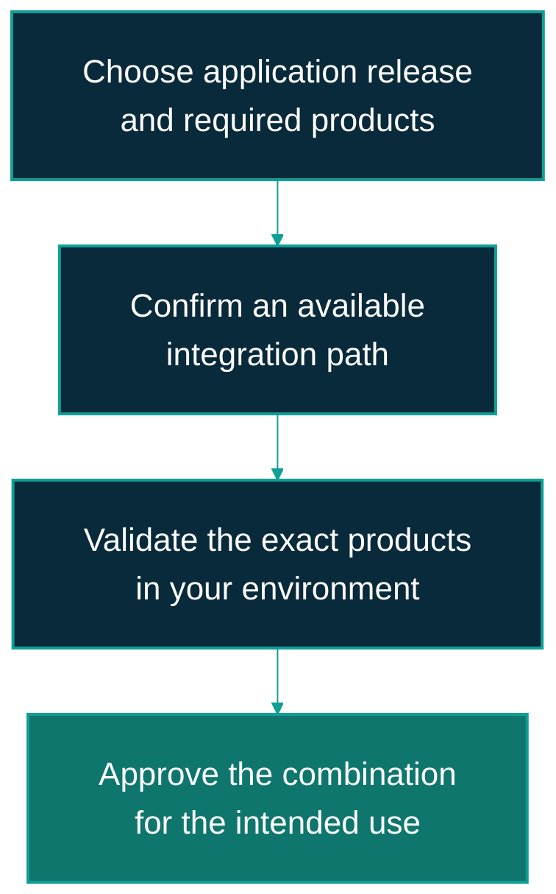

---
hide:
  - toc
---

# Business compatibility

ViewSense AI® is designed to fit around an organisation's chosen AI and platform products.
Compatibility depends on the application release, the selected integration, the upstream product
version, and the deployment environment. A matching API description alone is insufficient.

## Read the status before choosing a product

| Status in this guide | Meaning for a business decision |
|---|---|
| **Reference tested** | Automated tests exercise the bundled path. Development and mock components still require replacement for production. |
| **Environment acceptance required** | A documented integration or configuration path exists. The organisation must supply the upstream service and prove that the complete setup works. |
| **Planned** | Design intent exists; the integration is not available as a shipped working capability. |

These correspond to `validated`, `configuration-ready`, and `planned` in the
[detailed product matrix](../fabric/PRODUCTS.md). They are implementation readiness labels,
not vendor certification or a production support guarantee.

On smaller screens, scroll the diagram horizontally to see all the boxes.

This is the approval path for available integrations. A planned integration needs implementation
before it can enter environment acceptance.

## Product fit at a glance

| Business need | Available choices and status | What to establish before adoption |
|---|---|---|
| Use AI with company knowledge | Bundled PostgreSQL + pgvector: **Reference tested**. Mem0 OSS or Platform: **Environment acceptance required**. | Data permissions, ownership boundaries, retrieval quality, retention, and recovery. |
| Use a cloud AI supplier | OpenAI API adapter: **Environment acceptance required**. | Approved provider/model, credentials, data movement, quotas, and live quality/security tests. |
| Keep selected inference local | Ollama decisions, embeddings, and optional chat: **Environment acceptance required**; local decision/embedding retrieval has development evidence. | Model selection, compute capacity, upstream transport and identity, answer quality, and permitted outbound traffic. Local hosting alone does not establish an air-gapped deployment. |
| Connect enterprise sign-in | Keycloak or generic OIDC identity: **Environment acceptance required**. | User/role/tenant mappings, approved identity-product version, session behavior, and live acceptance. The development issuer is test-only. |
| Prepare company documents | Basic synchronous paragraph ingestion: **Reference tested**. | Suitable input preparation, access control, representative document tests, and handling of unsupported formats. A general document-conversion service is planned. |
| Govern agent activity | Bounded run lifecycle, budgets, manual approval and cancellation: **Reference tested**. | The workflow being evaluated and who may approve it. An autonomous execution worker is planned. |
| Apply provider rules | Built-in admission checks: **Reference tested**. OPA sidecar: **Environment acceptance required**. | Approved providers and policy ownership, evaluation criteria, update procedures, and evidence review. |
| Connect security and operations monitoring | JSON application logs: **Reference tested**. OpenTelemetry Collector and routing to Elastic or Splunk: **Environment acceptance required**. | Enterprise collectors/backends, routing, access and retention. Native application OTLP export is planned. |
| Fit enterprise networking and certificates | Cilium, Istio ambient, Certificate API and cert-manager profiles: **Environment acceptance required**. | Approved product versions, enforced isolation/encryption, trust rotation, workload reload, and recovery. Current recorded network acceptance remains incomplete. |

## Planned integrations to keep out of a pilot dependency list

| Area | Planned capability |
|---|---|
| Additional model hosting | vLLM and other OpenAI-compatible endpoints; changing an endpoint URL does not supply the required adapter. |
| Business tools | Native MCP Streamable HTTP transport. The tested mock uses a ViewSense AI® tool API, not native MCP. |
| Workflow engines | n8n, Temporal, and Argo Workflows adapters; selection intent is documented but no working adapter ships. |
| Additional agent runtime | LangGraph-compatible adapter and autonomous execution worker. |
| Workload identity | SPIFFE/SPIRE consumption; static development certificates do not provide this capability. |

## Deployment and version fit

Kubernetes is the packaging target. Enterprise data centres and private or public clouds are
deployment options in the architecture; this is not an unrestricted cloud, Kubernetes, operating
system, or hardware certification list. Platform owners must qualify their actual combination.

For procurement or an acceptance record, capture the ViewSense AI® release, the matching docs
release, upstream product versions, hosting environment, test results, responsible owner, and
support arrangements. Upstream products may have separate licences, service terms, and costs.

Use the **release dropdown** for the application's documentation baseline, then verify the chosen
combination against the [product matrix](../fabric/PRODUCTS.md) and
[conformance map](../design/high-level/00-implementation-conformance.md).
Published documentation does not monitor the health of a live installation.
