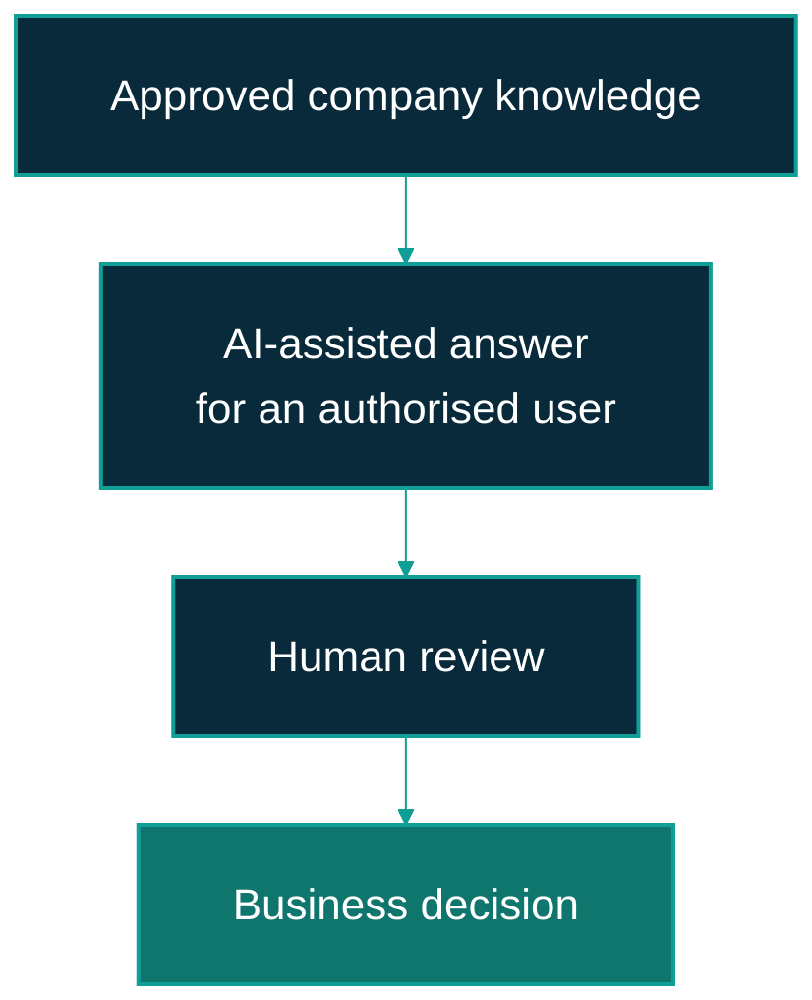

---
hide:
  - toc
---

# Business value and use cases

The business case for ViewSense AI® is a shared way to connect AI and company knowledge while
keeping access, supplier choices, and approval decisions under enterprise control. Benefits must
be demonstrated in a specific use case; the platform does not establish savings or answer quality
by itself.

## Start with knowledge assistance

A suitable pilot lets a limited group ask questions about approved company information. Start
with a small, prepared knowledge set and review answers against an agreed reference. The current
memory and response paths provide a basis for this evaluation; a real model requires environment
acceptance as described in the [compatibility guide](compatibility.md).

On smaller screens, scroll the diagram horizontally to see all the boxes.

This is a proposed pilot process. The business decision remains with the reviewer; the diagram
does not imply that the platform supplies a complete document-management or decision-approval application.

## Candidate use cases

| Use case | A bounded first evaluation | Dependency or limitation |
|---|---|---|
| Internal knowledge assistance | Answer questions from an approved policy or procedure set for one team. | Validate retrieval and answer quality; prepare the source text and enforce permissions. |
| Support-team assistance | Draft an answer using a small, approved support knowledge set, with an employee reviewing the result. | A case-management connector and automatic customer delivery are not included. |
| Local AI evaluation | Compare model decisions or grounded answers on representative non-sensitive examples. | Ollama is configuration-ready; development evidence is not a general model-quality guarantee. |
| Governed agent lifecycle | Exercise budget, approval, cancellation, and evidence decisions using controlled runs. | The current lifecycle is manually driven; autonomous task execution and business-tool adapters are planned. |

## Translate platform goals into measurable value

| Goal | Business measure to agree | Evidence to collect |
|---|---|---|
| Help employees find reliable information | Time to produce a reviewed answer and the proportion accepted by reviewers. | Representative questions, a baseline without AI, review scores, and correction reasons. |
| Preserve supplier choice | Effort to qualify and switch an approved provider for the same use case. | Compatibility tests, application changes, quality differences, and operating effort. |
| Control data access | Whether unauthorised users and disallowed data movements are blocked. | Negative access tests, data-flow review, and environment security acceptance. |
| Keep costs understandable | Cost per accepted answer or completed controlled run. | Model usage, infrastructure, integration, operations, review, and support costs. |
| Make approvals accountable | Whether owners can reconstruct an approval or cancellation without unnecessary confidential data. | Evidence completeness, access controls, retention decisions, and review outcomes. |

Define the comparison method and target before the pilot. Report quality and safety failures
alongside productivity results. Pricing, showback dashboards, and automatic savings calculations
are not established by this documentation.

## What a sponsor should fund

Budget for the selected model and hosting, knowledge preparation, integration work, platform
operations, security acceptance, and user training. Assign owners for incorrect answers, provider
outages, unexpected usage, and access failures. Agree a stop or rollback decision if the pilot
fails its acceptance criteria.

The [adoption and governance guide](adoption-and-governance.md) turns these choices into a staged
evaluation with clear ownership.
