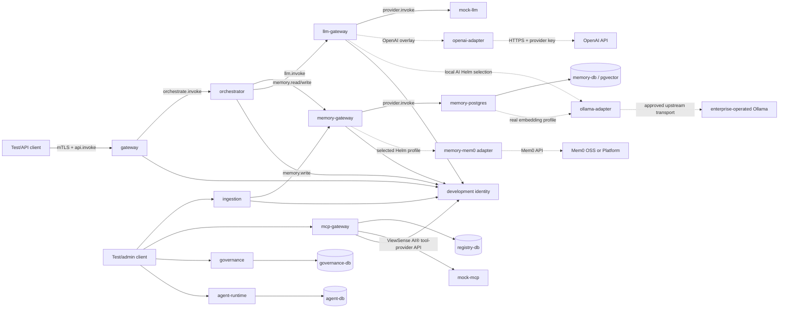
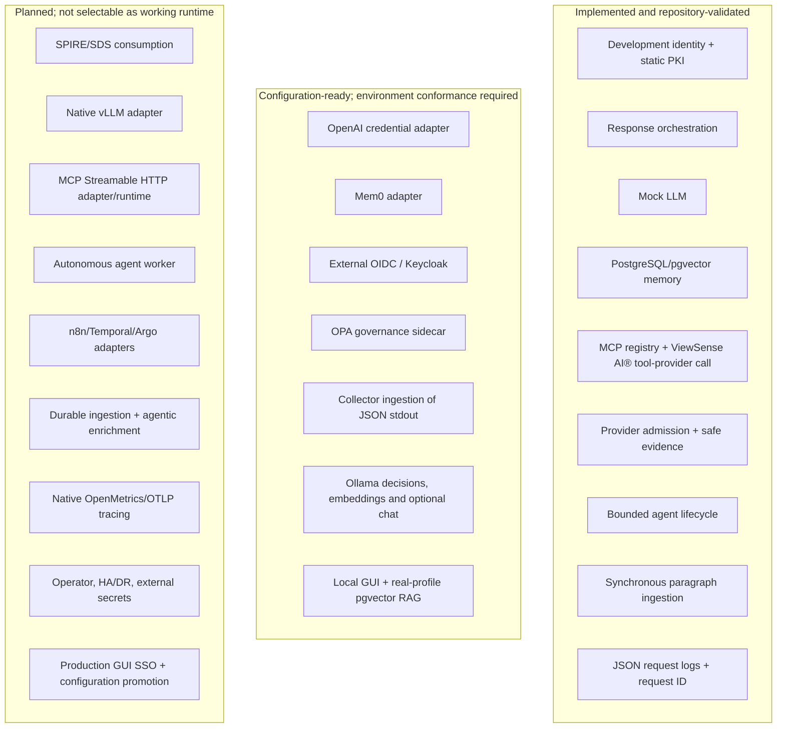
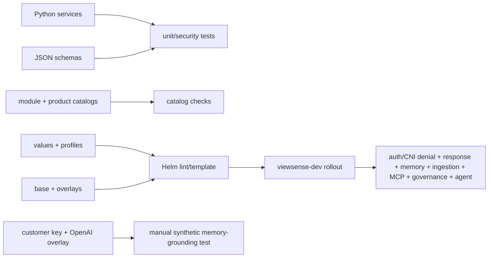

# ViewSense AI® Implementation Conformance

This is the truth map between architecture intent and the repository as shipped. The labels are:

- **implemented:** code, packaging, and an automated repository test exist;
- **configuration-ready:** the ViewSense AI® boundary exists, but an enterprise product or credential is required;
- **planned:** design or selection intent exists, but no executable adapter is shipped.

For a source assessment and the next delivery slice toward an enterprise harness for local AI,
see the [project status and local AI integration plan](01-project-status-and-local-ai-plan.md).
This map describes repository capability, not the configuration or health of a live installation.

## Detachable release preview GUI (major)

The follow-up source-checkout utility `scripts/release/console.py` is implemented. It verifies
bundle checksums and release namespace ownership, reads the existing smoke credentials/TLS into
private temporary host files, and starts twelve loopback-only forwards plus the existing GUI.
No Kubernetes resources or identity grants are changed. The selected context/namespace/version
are visible; service health is observed over mTLS. Existing ingestion, memory write and search
APIs use their original audience/scopes and fixed tenant. Other administration operations are
rejected in preview mode. Browser Host/Origin/session/CSRF protections remain intact.

The original 1.0.1 download assets are unchanged and remain headless. Preview tests cover anonymous
and CSRF rejection, exact namespace routing/scopes, unsupported-operation rejection and nonlocal
URL refusal. Live Green validation includes ingestion/search and owner isolation; the GUI labels
deterministic vectors and does not claim real-model or production administration acceptance.
Validation: 105 unit/security/design tests, Ruff and strict documentation build passed. Green
headless Helm smoke/CNI checks passed with the preview attached; browser ingestion and search
returned the synthetic document. The utility is separate from the original local Ollama harness
and `viewsense-dev` recovery.

## Release 1.0.1 packaging and environment replacement (major)

The versioned Helm chart, architecture-specific offline image/download packager, checksummed
installer and draft GitHub Release uploader are implemented. The installer requires an explicit
context and a new namespace identifying the release, such as `viewsense-release-1-0-1-blue`.
Independent PKI/signing/client/database material is generated outside existing development
directories. All four state owners remain namespaced and separate. Owned namespace deletion
has a UID precondition; reset recreates fresh state. Git checkout metadata, host credentials
and development runtime directories are excluded; Python runtime assets remain in the image.

The default full mock chart includes a Helm test Pod; selected external/partial profiles omit
that hook and need their own acceptance. The shared CNI probe script pairs allowed and denied
mTLS HTTP transfers. Negative unit tests cover namespace protection, existing-namespace refusal,
ownership checks and artifact corruption. Paired clean source commits are recorded in artifacts,
and draft upload verifies matching application/documentation tags.

Parallel whole-suite environments and state-safe promotion are defined in the
[replacement design](../../releases/parallel-environments.md). A stable cross-namespace or
cross-cluster traffic switcher is not shipped: ingress/trust, shared identity, state replication,
writer fencing and drain remain product-specific integration work. The default release is an
evaluation distribution, not a production admission decision. Static seven-day certificates,
mock inference/tools, deterministic embeddings, single-replica stores and existing enterprise
security/HA/telemetry gaps remain explicit.

### Release validation evidence

- Docker unit/security/design tests: 100 passed; source, tests and release-script Ruff checks passed.
  Helm lint/template for every profile, base Kustomize rendering, Kubernetes server-side dry run,
  strict documentation build and documentation release-publishing tests passed.
- ARM64 `k3d-cks`, Kubernetes `v1.31.5+k3s1` and Helm `v4.1.4`: independent blue and green
  release namespaces were installed with separate Secrets and four bound PVCs each. Green was
  deleted and recreated with a different namespace UID and new PVCs; end-to-end smoke passed.
- Green's gateway → orchestrator and orchestrator → memory-gateway mTLS transfers succeeded;
  gateway → ingestion and orchestrator → MCP gateway transfers were denied. Cross-namespace
  gateway → peer identity and orchestrator → peer memory gateway deny/allow-control/deny probes
  passed, with temporary policies removed. These are representative CNI checks, not complete
  production or Istio-ambient acceptance.
- The local server's CNI chain had no pod firewall rules after Docker resumed; restarting the
  server restored rule programming and the denial checks above. A successful API/readiness
  check alone must not be interpreted as CNI enforcement. Cluster resume/recovery still requires
  live policy probes. The release installer never disables policy to get a passing smoke test.
- Image imports on the small local runtime triggered transient disk pressure. Rebuildable unused
  Docker build cache was reclaimed; namespace lifecycle/data stayed scoped to release-test
  resources. The installer now refuses imports without disk headroom, waits for pressure to clear,
  and supports reusing preloaded images for parallel environments.

AMD64 image builds are supported by the packager; the local Kubernetes evidence is ARM64.
GitHub publication and matching release tags are operator-owned steps, not claimed as completed.

## Executable reference topology

Solid arrows are calls made by the current code. No arrow means no runtime dependency, even when a
future design allows one.

All solid internal ViewSense AI® service-to-service calls above use TLS with a client certificate plus
a short-lived audience/scoped token. Calls from provider adapters to external vendor APIs instead
use the vendor's HTTPS authentication contract. The development CA proves encrypted, authenticated
transport; it does not provide SPIFFE identity binding. Tenant context is carried in the signed
Trust Envelope.

## Capability maturity

## Implemented HTTP surface

Every service also exposes an unauthenticated, payload-free `GET /healthz` over required mTLS.
FastAPI supplies runtime OpenAPI for the routes below; committed OpenAPI snapshots are not yet
shipped.

| Service | Implemented routes | State owner |
|---|---|---|
| identity | `POST /oauth2/token` | development client file and signing key |
| gateway | `POST /v1/responses` | none |
| orchestrator | `POST /v1/responses` | none |
| llm-gateway | `POST /v1/chat/completions` | static route configuration |
| mock-llm, openai-adapter | `POST /v1/chat/completions` | adapter configuration/credential only |
| ollama-adapter | `POST /v1/chat/completions`, `POST /v1/decisions`, `POST /v1/embeddings`, `GET /v1/provider-status`, `PUT /v1/configuration` (opt-in development administration) | model configuration; no memory |
| memory-gateway | `POST /v1/memories`, `POST /v1/memories/search`, `POST /v1/memories:reembed` (requires `memory.admin`) | none |
| memory-postgres, memory-mem0 | same provider contract as memory gateway | provider-owned memory |
| mcp-gateway | `PUT /v1/servers/{name}`, `POST /v1/tools/call` | MCP registry PostgreSQL |
| mock-mcp | `POST /v1/tools/call` | none |
| governance | `PUT /v1/provider-passports/{name}`, `GET /v1/provider-passports/{name}`, `POST /v1/provider-passports/{name}/evaluations`, `POST /v1/provider-passports/{name}:admit`, `POST /v1/evidence-events`, `GET /v1/evidence-events` | governance PostgreSQL |
| ingestion | `POST /v1/documents:ingest` | no durable job state; writes chunks through memory API |
| agent-runtime | `POST /v1/agent-runs`, `GET /v1/agent-runs/{run_id}`, `POST /v1/agent-runs/{run_id}:resume`, `POST /v1/agent-runs/{run_id}:cancel`, `GET /v1/agent-runs/{run_id}/events` | agent PostgreSQL |

## Alignment decisions

| Architecture claim | Repository evidence | Status |
|---|---|---|
| replaceable model provider | static LLM gateway route; mock, OpenAI and Ollama adapters | mock implemented; real providers configuration-ready |
| local model runtime | Ollama adapter implements decision, embedding and optional chat protocols | configuration-ready; local development decision/embedding/RAG path verified; vLLM still planned |
| embedding model | optional authenticated embedding client; model-digest profiles and separate variable-dimension vector table with resumable owner backfill | real integration configuration-ready; deterministic 64-d reference remains default base profile |
| management GUI | loopback console owns sessions and calls provider/memory APIs; local model selections, component drilldowns and live tests | implemented development console; production SSO/admin control plane planned |
| replaceable memory | gateway plus PostgreSQL and Mem0 adapters | PostgreSQL implemented; Mem0 configuration-ready |
| MCP hosting | registry and custom tool-provider invocation exist | native MCP transport/runtime planned |
| agentic execution | durable manual lifecycle and approval transitions | autonomous planner/tool worker planned |
| workflow integration | values and design intent only | planned |
| enterprise SSO | generic OIDC verifier at gateway | configuration-ready; no IdP is installed |
| workload identity | static development certificates plus scoped JWTs | SPIFFE/SPIRE consumption planned |
| policy | built-in admission and optional OPA sidecar | implemented/configuration-ready |
| observability | JSON stdout, request ID propagation, inbound `traceparent` logging | native metrics, trace propagation, and OTLP export planned |
| audit/evidence | payload-minimized append-only API semantics in PostgreSQL | implemented reference; immutable export planned |
| Kubernetes isolation | ServiceAccounts, restricted contexts, default-deny NetworkPolicy manifests | manifests implemented; recorded local runtime probe failed: gateway could reach ingestion; cluster enforcement gate remains failed |

### Local AI and embedding profiles

The AI endpoint exists. The Ollama adapter now accepts the internal mTLS/JWT boundary; the OpenAI
adapter remains pinned to its cloud host. Tev1 decisions use a separate `/v1/decisions` contract,
not chat completion. The local console invokes this directly as a fixed-tenant development client.
Optional chat can be selected through the existing LLM gateway after configuring a chat model.
Decision verification compares native and console probabilities: the ungrounded green-sky
example incorrectly favored true. The GUI separates question identifiers from answers and provides
a visible reference/agreement default; this does not add retrieval or deterministic factual checks.

Ollama chat translation uses native `/api/chat` with `stream:false` and returns the internal
`choices[].message.content` envelope. A short synthetic Qwen policy question completed locally;
a longer prompt hit an upstream MLX threadgroup limit. This is connection evidence, not
long-generation stability or response-quality certification. The console chat preview has a 240-second provider deadline
and 260-second hop timeout for the local Qwen model, plus visible elapsed time. Existing public
gateway/orchestrator budgets are shorter and must be configured before certifying that slow route.

`VS_EMBEDDING_PROVIDER_URL` enables real-profile writes/queries. `memory_embeddings` stores vectors,
model/revision/dimensions and a profile keyed by memory ID; the legacy `memories.embedding vector(64)`
is retained for development rollback. Search returns 409 if the tenant/owner has records missing the
current profile. `/v1/memories:reembed` backfills bounded batches without deleting old vectors.
The provider owns all SQL; the console and gateways use only APIs. Mem0 upstream embedding
configuration remains separate. Vector ANN indexing and production migration job orchestration
remain future work; current semantic queries perform exact cosine ordering.

### Isolated development console

`make console` runs the browser surface at `http://127.0.0.1:8787`, separate local identity,
Ollama adapter, memory provider/gateway and ingestion APIs on ports 8840–8844, and a Docker-managed
pgvector volume on loopback port 15432. Internal service calls retain mTLS/JWT. The browser uses an
HttpOnly session, same-origin JSON and CSRF verification; local bootstrap credentials never become
provider keys. This development console is not installed in the production Helm topology.

| Console routes | Purpose |
|---|---|
| `GET /`, `/static/*` | browser UI/assets |
| `POST/GET/DELETE /api/session` | development session bootstrap, recovery, logout |
| `GET /api/components`, `GET /api/history` | observed health and payload-free test history |
| `GET/PUT /api/configuration` | inspect/update installed local model selections via adapter API |
| `POST /api/tests/decision`, `POST /api/tests/embedding` | real local model tests |
| `POST /api/tests/model` | admin-authorized selected-model decision/embedding/chat preview without changing saved defaults |
| `POST /api/tests/memory`, `POST /api/tests/search`, `POST /api/tests/reembed` | store/search/backfill through memory gateway |
| `POST /api/tests/ingestion`, `POST /api/tests/rag` | document chunking and store/retrieve/optional decision on context |

See [local console design](10-overall/06-local-ai-console.md) for trust boundaries and production
gaps. The base Kubernetes mock regression does not prove Ollama networking, GPU sizing or local
console behavior; those need their separate provider/live/browser suites.

`POST /v1/model-tests` is an opt-in `provider.admin` adapter route for installed-model previews.
Dropdown selection does not modify pinned inference or persistent memory profiles. The GUI enables
Save as default after a successful preview and carries discovered embedding dimensions into the
explicit configuration update. Full module lifecycle control and production model admission remain gaps.

## Verification map

This file must be updated when a route, service edge, state owner, product readiness level, or test
gate changes. Target-state diagrams elsewhere must link back here and must not be described as
currently deployed.

The local harness supports API-only startup and an independently attached GUI, with direct mTLS/
scoped-token component tests and additive binary decision probabilities. See the
[detachable API harness contract](10-overall/06-local-ai-console.md#detachable-local-api-harness).

The [platform-wide headless API requirement](design_01.md#platform-wide-headless-api-requirement)
applies to all modules, including roles, policy and observability. Those management/export/query
surfaces are explicit backend gaps, not GUI-owned substitutes. The optional console and the
Kubernetes API suite are independently replaceable clients/runtimes.

## Enterprise SSO / certificate redesign (major)

New boundaries: provider registry at the edge, browser code/PKCE login in the optional console,
verified user role mapping and per-operation scope enforcement, edge-to-component narrowed
workload delegation, certificate service public-file / namespaced cert-manager inventory and
status-only renewal. New APIs: `/v1/auth/providers`, `/v1/auth/me`, `/v1/auth/roles`, component
facades, `/v1/certificates`, certificate detail/renewal and authenticated certificate metrics.
OpenAPI remains served by each backend; GUI `/api` routes are client conveniences.

Implementation and live acceptance evidence are recorded below.
Keycloak and cert-manager are separately packaged POC integrations. Existing development PKI,
provider configuration promotion, session HA/backchannel logout, Okta acceptance, workload TLS
hot reload, trust distribution and durable security audit export are production gaps.

Console routes: `/auth/providers`, `/auth/login/{provider_id}`, `/auth/callback`, `/api/auth/me`,
`/api/auth/roles`, `/api/certificates`, `/api/certificates/{namespace}/{name}:renew`.
Certificate routes: `/v1/certificates/{namespace}/{name}`, `/v1/certificates/{namespace}/{name}:renew`,
`/metrics` (requires certificates.read). Platform routes: `/v1/platform/catalog`,
`/v1/platform/suites`, `/v1/platform/status`, `/v1/platform/suite-plans`;
GUI client routes `/api/platform/catalog`, `/api/platform/suites`, `/api/platform/status`,
`/api/platform/suite-plans`. Suite plans are inspection output, not a cluster deployment API.

The edge additionally exposes `/v1/models` as installed inventory, and the local AI component
facades retain `/v1/provider-status`, `/v1/configuration`, `/v1/model-tests`, `/v1/decisions`,
`/v1/embeddings`, `/v1/chat/completions`, `/v1/memories`, `/v1/memories/search`,
`/v1/memories:reembed`, `/v1/documents:ingest`. These facades are configured in the isolated local
SSO runtime; the canonical reference cluster retains its existing orchestrator/component edges.
Missing provider deployments or workload grants fail closed and are not created by suite selection.

An optional development certificate bridge combines local and Kubernetes inventory by calling
both certificate APIs. It uses a separate certificate-only broker client and the cluster's TLS
trust material; it does not reuse local tokens across issuers. User subject and tenant are delegated
through the signed workload envelope. Each inventory item identifies its environment, and only
cert-manager resources with both the configured renewable name and renewal approval label support
the renewal action.

### Management POC evidence

- `make unit`: 80 passed; `make lint`, `make profile-check`, base Kustomize render and
  `make docs-build`: passed. The certificate controller Helm path rejects missing explicit egress.
- `make k8s-deploy`: passed. Separate Keycloak pod is Ready; certificate API and three cert-manager
  controller pods run independently. Legacy cert-manager is an explicit upstream-EOL POC exception.
- `scripts/test-enterprise-poc.py --renew-canary`: passed headless OIDC/scopes, four suite plans,
  three installed models, complete 29-item public inventory across both environments, canary
  revision 1 → 2, stale renewal 409 and root renewal 403.
- `scripts/test-management-browser.py`: passed browser code/PKCE SSO, all five management pages,
  suite plan/download, mobile layout, viewer denials for renewal/planning/write, same-tenant RAG
  read and cross-tenant RAG isolation. Desktop/mobile screenshots are in
  `artifacts/management-console`. Test credentials and tokens are not in those artifacts.
- Certificate ServiceAccount RBAC: Secret get denied, named canary status patch allowed,
  root status patch denied.
- `make k8s-test`: application smoke passed, NetworkPolicy negative connectivity failed:
  gateway → ingestion returned probe status 0 despite the denial policy. This existing local CNI
  regression blocks production security acceptance; manifest rendering does not prove enforcement.

Production acceptance for that SSO/certificate POC remains incomplete. The historical CNI failure
has subsequent representative recovery evidence in the release 1.0.1 section above. Product
suite selection is a plan; deployment apply, Okta live acceptance, HA identity/sessions, native OTLP,
immutable audit export and coordinated workload/trust rotation are not implemented by this POC.

## Networking / mesh implementation — runtime acceptance pending (major)

The replaceable CNI/mesh reference, neutral allowed-flow contract, strict Istio policy adapter,
headless networking metadata/evidence/plan APIs and GUI page are implemented in source. The portable
base and Helm packaging preserve distinct database ServiceAccounts through redeployment. Runtime
acceptance is incomplete; no installed chart or manifest alone establishes enforcement. Existing
cks was non-compliant at that networking baseline and its data is not migrated by creating the
networking acceptance cluster. The release 1.0.1 evidence above records subsequent local CNI
recovery and representative checks; full mesh acceptance is still incomplete.

Networking routes: `GET /v1/networking/providers`, `GET /v1/networking/topology`,
`GET /v1/networking/status`, `POST /v1/networking/plans`. Inspection requires `platform.inspect`;
planning requires `platform.plan`. Console client routes: `/api/networking/{operation}`
(only providers/topology/status) and `/api/networking/plans`. Evidence reports its cluster,
topology/provider-profile hashes and timestamp; stale, failed or mismatched evidence cannot imply current health.

### Networking evidence

- Independent two-node `k3d-viewsense-network` created with Kubernetes `v1.35.8+k3s1`,
  Flannel and the competing k3s policy controller disabled. Cilium 1.20.2 and Istio ambient 1.31.1
  upstream releases installed successfully. Cilium, DNS and storage were healthy before mesh install.
  Hubble relay has TLS; no GUI cluster credentials were introduced.
- The empty initial networking cluster was rebuilt to remove an incorrect shared BPF mount between
  Docker nodes. No application PVCs existed there; the original cks cluster was preserved.
- Local Python validation: 89 unit tests passed; Ruff source/tests/operator-script checks, all
  Helm profiles, JavaScript and shell syntax, and base Kustomize rendering passed.
- The Docker unit run initially failed on a missing operator-script path in the test image;
  its Dockerfile copy is corrected and the local catalog tests pass. Required Docker `make unit` /
  `make lint` reruns and the application deployment/test commands were prevented from starting by
  automatic approval review timeouts, including after explicit user permission.
- Application mesh enrollment, cross-node CNI/identity/plaintext denials, encrypted database traffic,
  restart/recovery acceptance and the new Networking browser page have **not** passed live acceptance.
  No successful networking verification report was fabricated. Run the operator guide's deployment
  and acceptance targets when execution access is restored. Existing GUI/API processes also need
  restarting to load the new routes; source changes alone do not update a running process.
- The evidence producer publishes only public metadata into a namespaced ConfigMap. The application
  gateway mounts it read-only; status is `unverified` until complete matching checks exist, becomes
  `stale` after ten minutes, and always reports `live_health:not_monitored`.

Design sync for that networking/mesh baseline is **FAIL** pending its full runtime/browser
acceptance. Release 1.0.1's Docker checks and representative local CNI recovery do not establish
acceptance for the independent Cilium/Istio stack. This reference is not production-ready: persistent-data cutover, provider
overlays beyond the base flow graph, HA/load tests, approved mesh trust/rotation, ingress/egress
gateways and durable protected telemetry remain deployment work.

## Health badges and certificate explanations — minor presentation change

The capability inventory, selected component and Observability reachability rows share
non-interactive status badges: green reachable/ready, amber checking/degraded/unknown, red
unavailable/failed and neutral outside the local stack. Light/dark foreground/background tokens
retain the status text and dot; sampled badge contrast is at least 5.35:1 in light and 7.25:1 in dark.
The certificate table has a Reason column explaining the existing API expiry state and public
readiness/not-before/issuance metadata. Warning is within seven days, critical within 24 hours,
expired after not-after, and unknown when expiry metadata is unavailable. No API, authorization,
classification policy, ownership, deployment resources or SLO changes were introduced.

Evidence: `make unit` passed (89 tests), `make lint` passed, base Kustomize rendering,
JavaScript syntax and `make docs-build` passed. Browser previews using the actual UI assets and
explicit synthetic data verified health states, dark/light colors, all five expiry explanations,
issuance/readiness context and no document overflow at the desktop viewport. Screenshots are in
`artifacts/status-preview`. Live SSO browser QA encountered the POC CA trust error; no browser
certificate warning was bypassed and no trust settings were changed. The separate networking
runtime acceptance above remains pending; Docker unit/lint execution has since succeeded.

## Documentation repository ownership (minor)

All maintained narrative documentation, design/conformance records, module/integration
and operations/test guides, governance prompts, diagrams, and documentation screenshots
are owned by `aiops-fabric-docs`. The implementation repository retains only its root README
and agent guidance as pointers; executable schemas, catalogs, deployment resources, and
runtime source remain in `aiops-fabric`. This migration changes documentation ownership,
publishing, and verification paths; it adds no runtime route, data owner, trust boundary,
deployment resource, or SLO change.

The dedicated repo owns Zensical configuration, the ViewSense AI® theme, and the sole Pages
workflow. Implementation Make targets delegate docs builds/previews to `DOCS_REPO` and mount
its `docs/` read-only for Docker unit/catalog checks. Direct pytest uses `VS_DOCS_DIR` or the
sibling checkout. Design-contract entries in module catalogs reference sibling docs-repo
source paths; machine-readable schema entries stay implementation-relative. All existing
Markdown sources and documentation assets were moved, preserving working-tree design edits.

See the [publishing and migration record](../../publishing.md#migration-record)
and [repository instructions](../../engineering/repository-instructions.md#documentation-ownership)
for the layout and coordinated merge rules. Existing networking/production acceptance gaps
recorded above are unchanged by this documentation migration.

Migration validation: the strict Zensical build and delegated implementation `make docs-build`
passed; all 53 current Markdown pages appear in navigation; 89 Docker unit tests passed;
`make lint`, base Kustomize rendering, Python/shell syntax, and whitespace checks passed.
Migrated documentation assets and unrelated working-tree console edits were verified unchanged.
The generated executable HTML console preview remains private with the implementation.

## Portable documentation hosting (minor)

The site configuration uses build-time placeholders for its hosting base and documentation
repository identity. GitHub Actions reads the configured Pages URL before building; local
builds default to the preview server or accept `DOCS_SITE_URL`. Repository links derive from
Actions metadata or the local Git origin. No hosting account or domain is fixed in the sources.
Markdown and asset links remain relative, including navigation from nested pages.

Implementation module catalogs reference Markdown contracts using
`../aiops-fabric-docs/docs/...`. Catalog validation resolves these through `VS_DOCS_DIR`
for alternate checkouts and Docker mounts; machine-readable schemas remain relative to the
implementation repository. Runtime APIs, trust boundaries, data owners, deployment topology,
and SLOs are unchanged.

Evidence: a strict build for a different domain with a nested URL prefix passed; all 53 pages'
canonical URLs, sitemap entries, stylesheet paths, and derived repository links were verified.
The local/delegated strict build, 89 Docker unit tests, lint, and base Kustomize rendering passed.
Existing production/runtime acceptance gaps above remain unchanged. See the
[build-time hosting guide](../../publishing.md#build-time-hosting-base).

## Release documentation and date-free writing (minor)

Documentation headings and prose use descriptive names without calendar dates. Existing dated
headings and their internal links were updated; fixed timestamp examples now use a format
placeholder or a value generated at execution time. Versions and paired commit references identify
release baselines while Git retains change history.

The site header uses Zensical's release dropdown, backed by a generated `versions.json` catalog.
Latest documentation lives under `latest/`; `vMAJOR.MINOR.PATCH` tags in the documentation repo
snapshot the content, navigation, and assets for matching application releases. Every Pages build
includes all tagged snapshots alongside latest, using the configured hosting base and current
pinned toolchain. Old unversioned URLs redirect to latest while retaining query strings/headings.
Version switching retains equivalent pages when available and otherwise opens the selected
release homepage. Search is scoped to each snapshot. No private-application access is required.

Tag-triggered builds use main's publisher and latest documentation; deployments are serialized.
Release-content preservation across repeat builds, version ordering, alternate-domain/nested-base
URLs, and selector metadata are covered by isolated Git-fixture publishing tests. The strict site
build and browser navigation verify the selector. Runtime APIs, trust boundaries, data owners,
application deployment topology, and SLOs are unchanged; existing production acceptance gaps remain.

Validation: 89 application unit tests, lint, and base Kustomize rendering passed. Release publishing
tests verified version ordering and unchanged release content across repeated builds; a missing
homepage left the previous artifact intact. Browser checks using clearly labelled sample releases
verified page/heading/query preservation, missing-page fallback, redirects under a nested hosting
base, and the dropdown's styling and availability after scrolling. The actual repository has no
release tags yet and offers Latest until a reviewed release snapshot is tagged.

Follow the [application-release documentation workflow](../../publishing.md#documentation-per-application-release)
when recording paired implementation/documentation release commits.

## Business documentation and management diagrams (minor)

The dedicated Business navigation section expands the executive overview and adds compatibility,
value/use-case, and adoption/governance guides. Its compatibility labels translate the product
matrix's validated, configuration-ready, and planned states into business decisions; they do not
claim vendor certification or production readiness. The guides distinguish manually driven agent
lifecycle tests from planned autonomous execution and retain the existing network/operations gaps.

Management Mermaid diagrams use four or five boxes, larger labels, accessible titles/descriptions,
and navy/teal colours. The Business pages omit the secondary contents sidebar to give diagrams and
tables more room. Diagram containers scroll horizontally on narrow screens without shrinking the
labels or widening the page. The section uses relative links and the existing release snapshot
pipeline; historical documentation tags keep their original content.

Validation: strict documentation build and release publishing tests passed; all 56 Markdown pages
appear once in navigation. Browser previews verified all four diagrams, light/dark contrast,
Business navigation, and horizontal scrolling at a narrow viewport without page overflow.
Application unit tests passed (89), lint passed, and base Kustomize rendering passed.
There are no changes to application APIs, trust boundaries, data owners, runtime configuration,
deployment topology, or SLOs. Existing production acceptance gaps remain as recorded above.
