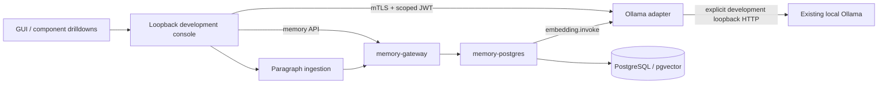

# ViewSense AI® Project Status and Local AI Integration Plan

Includes the local AI console changes after baseline `0001b14`.
The [implementation conformance map](00-implementation-conformance.md) is the canonical route and
runtime inventory. Live evidence below applies to the isolated development stack, not production.

## Enterprise harness for local AI

Applications use stable ViewSense AI® APIs while the enterprise controls model access, identity,
company knowledge, tools, data location and evidence. Local decisions and embeddings are now
connected through a provider adapter. The management GUI provides component details, local model
selection and live decision, embedding, ingestion, retrieval, chat and profile-backfill tests.
Installed-model dropdowns also support decision, embedding and chat previews before an explicit
Save as default. Known incompatible choices remain visible and disabled. Previewing does not
modify memory profiles; saving a new embedding model requires owner backfill for existing records.

The edge AI endpoint already existed at `POST /v1/responses`. A mock remains the base regression
provider; OpenAI is optional. The new local console is a separate development entrypoint with its
own PKI, fixed tenant and pgvector volume. It does not replace enterprise SSO or a production
administrative control plane.

| Capability | Current state | Remaining work | Evidence |
|---|---|---|---|
| Response API | Implemented edge → orchestrator → memory/LLM flow | Streaming, quotas, richer errors/deadlines and policy routing | `src/viewsense_gateway/app.py`, `src/viewsense_orchestrator/app.py` |
| Local decisions | Ollama adapter calls Tev1 System One using named questions | Representative decision evaluations (ungrounded green-sky judgment failed); runtime admission enforcement | `src/viewsense_ollama_adapter/`, live supplied sky example |
| Local embeddings | Ollama adapter calls EmbeddingGemma; validates vector count, dimensions, finite values, model/revision | Batch throughput, capacity and broader quality evaluation | Live 768-dimensional embedding response |
| Local chat | Native Ollama `/api/chat` normalized to the internal completion contract; Qwen available in model dropdown | Longer-generation MLX stability, grounded quality evaluation, public-route deadlines | Adapter contract tests; short synthetic policy prompt answered locally |
| Vector memory / RAG | PostgreSQL/pgvector exact cosine retrieval with tenant/owner and model-digest profile isolation | ANN indexes, lifecycle/export, scale and production recovery | `src/viewsense_memory_postgres/app.py`; live paraphrase retrieval |
| Existing vectors | Legacy 64-d vectors retained; separate versioned real-vector table; bounded owner backfill API | Durable migration jobs and production rollout/restore drills | `/v1/memories:reembed`; partial migration returns 409 |
| Management GUI | Working loopback development console, installed-model selections and component/test drilldowns | Enterprise SSO/RBAC, audited config promotion and full module administration | `src/viewsense_console/`; `make console` |
| Ingestion | Synchronous paragraph chunks written through memory API | Parsing/OCR, durable jobs, deletion and classification controls | `src/viewsense_ingestion/app.py` |
| Tools and agents | Tool registry/custom provider calls and bounded durable agent lifecycle | Native MCP and autonomous model/tool workers | Existing component modules; not launched by isolated console |
| Governance and operation | Admission/evidence APIs, dev mTLS/JWT, OIDC verifier, JSON logs and Kubernetes packaging | Live admission enforcement, renewable identity, external secrets, telemetry, immutable audit, HA/DR and supply chain | [Enterprise controls](60-enterprise/01-enterprise-integration-controls.md) |

## What the selected models do

`tev1:0.8b` is a decision capability, called upstream at `/v1/systemone`; it is not interchangeable
with a prose chat model. Its `noul` output is a probability of true. The supplied
`embeddinggemma-2:270m` sample contains 768 normalized values. Generation, judgment and embeddings
remain separate capabilities. `qwen3.8:27b-mlx` supplies text generation through native
`/api/chat`; the short Chat default asks whether an unapproved confidential report may be sent
to a consultant, requesting a brief answer and two safe next steps. Model probabilities do not
grant access or authorize actions. The GUI labels each question name separately from its true/false
probabilities and offers visible reference context. The original ungrounded sky pair returned
0.8764 for blue and 0.7334 for green directly from Tev1 and through the harness. A clear-day
reference/agreement test returned 0.9864 and 0.0232 respectively under `claim_matches_reference`.
The earlier GUI default with identifier `is_true` returned 0.9652 and 0.0242, matching the native
response for those exact requests. Broad accuracy remains unproven.

See the [console/provider design](10-overall/06-local-ai-console.md) for contracts and official
upstream references. No model weights are downloaded by this implementation.

## Executable local development flow

Run `make console` with Python 3.12, OpenSSL, Docker Desktop and local Ollama available. The launcher
opens the GUI, prepares separate development identity/material and retains its pgvector volume when
stopped. A supplied launch fragment is exchanged for a browser session and removed from the URL.
The GUI never receives service credentials. If the database or model is unavailable, the interface
reports a real failure, not simulated success.

The public response path can use the Ollama chat adapter through the existing LLM route after an
operator selects a chat model, configures credentials/trust/egress and completes its conformance
checks. The current public gateway/orchestrator budgets (50/55 seconds) also need alignment
before certifying minute-long Qwen requests; the longer console preview budget does not change
that route. The cloud setup remains in the [quick start](../../QUICKSTART.md#enable-openai-securely).

## Embedding compatibility and migration

Both write and query embeddings use the same adapter and a profile derived from model tag, installed
digest, dimensions, metric and preprocessing version. Model revisions at identical dimensions can
still be incompatible. Profile changes never silently search old vectors or fall back to hashes.

The original `memories.embedding vector(64)` is retained. The new `memory_embeddings` table owns
real vectors keyed by memory ID and profile, with model/revision/dimension metadata. Create persists
record and real vector atomically. Search returns 409 if any of the tenant/owner's records lack the
active profile. The console's Backfill action processes bounded batches; repeat until `remaining`
is zero. Network calls occur outside database leases. Existing memory is not deleted or reshaped.
Mem0's upstream embedder is configured separately and does not change the PostgreSQL provider.

## Evidence and next gates

The local development path has produced a Tev1 probability, a real 768-d embedding, and stored and
retrieved a synthetic source paragraph using a paraphrased query. A further Tev1 request used that
retrieved context. These prove the connection and reference flow, not a broad accuracy benchmark.

Qwen answered the short policy question through native Ollama in about 22 seconds, then
through the authenticated GUI/adapter flow in 13.7 seconds with the model loaded. The GUI check
verified elapsed status, disabled controls during inference, mobile layout and unchanged saved defaults. The earlier
longer prompt failed twice inside Ollama 0.40.2 with an MLX threadgroup limit error (960 threads
requested, 896 allowed). No model settings were silently changed to obtain the shorter result.
The answer correctly withheld permission but added policy details not supplied in the question,
so response-quality certification remains open. Chat previews allow four minutes and display elapsed
wait time; thinking and completion content are excluded from service logs.

The automated unit/security suite passes (57 tests). Live dropdown checks verified every installed
model is listed, capability-incompatible choices are disabled, previews preserve defaults, explicit
saves persist across reload, and unsaved embedding selections cannot run stored-knowledge operations.
Live checks also verified owner isolation,
profile-mismatch denial, bounded backfill, idempotent retry, profile rollback and retrieval of the
same stored record after restarting the APIs and database container. Desktop/mobile browser checks
exercise login, drilldowns and live embedding results. Lint, strict docs and Helm/Kustomize rendering
pass. Base Kubernetes deployment and end-to-end smoke pass, but `make k8s-test` fails its negative
gateway-to-ingestion connectivity probe: this local cluster is not enforcing the intended denial.
That security gate must pass before cluster promotion; rendered policy is not enforcement evidence.

Next gates are repairing cluster policy enforcement, selected-provider quality evaluation and
enterprise operation. The isolated console intentionally
shows agents, tools and governance as repository capabilities outside its running local stack.
Full module lifecycle administration requires separate authenticated control APIs.

Local adapter/GUI/vector changes are major under the [design-sync policy](../../prompts/governance/major-change-policy.md).
Production readiness still requires the [enterprise matrix](60-enterprise/01-enterprise-integration-controls.md)
and [roadmap](50-roadmap/01-roadmap-maturity.md) gates; the GUI does not itself establish those controls.

The [platform-wide headless API requirement](design_01.md#platform-wide-headless-api-requirement)
applies to all modules, including roles, policy and observability. Those management/export/query
surfaces are explicit backend gaps, not GUI-owned substitutes. The optional console and the
Kubernetes API suite are independently replaceable clients/runtimes.

Recorded headless acceptance: decisions, real 768-d embeddings and persistent
store/search/owner isolation passed through component mTLS APIs with port 8787 absent.
Attaching then stopping the optional GUI left all five API health checks and direct smoke
operational. Component OpenAPI documents and unauthorized/wrong-scope denial checks passed.
The cloudy/dark reference and blue claim returned a favored false answer under the stable
`claim_matches_reference` identifier; GUI and backend probabilities matched. The complete
headless design includes still-missing role and telemetry APIs rather than treating the GUI
as their implementation. Kubernetes smoke passed; its existing CNI denial gate still failed.

The optional GUI also stayed running while the API-only launcher was restarted; valid CA,
identity grants, model configuration and database credentials were preserved and GUI component
requests recovered. This verifies lifecycle independence in both directions for the local stack.

## Management console, SSO and certificate POC

The optional console now has Overview/suite planning, AI/models, Identity/access, Certificates and
Observability pages. The headless gateway owns provider/user/role context, product catalog, suite
plans, component facades and certificate administration; UI state does not define deployment truth.
Keycloak is a separate TLS Kubernetes pod/PVC. OIDC provider configuration is modular, with explicit
role-to-scope mapping and code/PKCE/state/nonce browser login. Certificate inventory combines local
and Kubernetes public metadata through scoped APIs; cert-manager owns canary issuance and renewal.

POC scope: suite planning/download, API reachability and expiry telemetry are implemented. Deployment
apply/GitOps, central telemetry query/export, audited config promotion, CA/workload migration,
workload hot reload, HA sessions/IdP/database and Okta live acceptance remain gaps. The legacy cks
cluster requires an explicitly selected compatible EOL cert-manager release and still fails its
CNI negative-denial gate. See the [operating guide](../../deploy/integrations/keycloak.md).

## Networking status

The [modular networking design](20-deployment/02-modular-networking-mesh.md) and
[operator guide](../../deploy/integrations/networking.md) now define replaceable CNI and mesh
boundaries. Cilium and Istio ambient releases are installed in a separate supported two-node POC
cluster. The Networking GUI/API, strict flow-policy adapter and acceptance tools are implemented
in source; harness deployment, traffic/recovery tests and browser acceptance remain blocked by
execution approval-service timeouts. Local unit/lint/Helm validation passes. No complete networking
evidence or migration of the existing cks data is claimed; design sync remains FAIL pending the
required runtime validation recorded in the conformance map.
