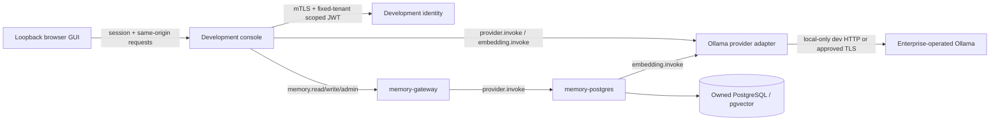

# ViewSense AI® Local AI Console and Provider Design

## Objective and delivery boundary

Provide one GUI to inspect components, configure local model connections, drill into readiness and
contracts, and test decisions, embeddings, stored knowledge and retrieval. The initial delivery is
a **single-tenant development console** on loopback. It is not enterprise SSO, a Kubernetes
operator, or a production administrative control plane. Enterprise deployment continues to require
the [control matrix](../60-enterprise/01-enterprise-integration-controls.md).

Implementation status and actual routes are maintained in
[conformance](../00-implementation-conformance.md); the
[project status](../01-project-status-and-local-ai-plan.md) explains the delivery priorities.

## Concrete local models

The supplied examples identify two separate capabilities:

| Capability | Local model | Upstream contract | Meaning |
|---|---|---|---|
| Decision | `tev1:0.8b` | `POST /v1/systemone` | Classify or judge a supplied state using named questions; `noul` is a probability of true |
| Embedding | `embeddinggemma-2:270m` | `POST /api/embed` | Map text into numeric vectors for retrieval |
| Generation | Installed `qwen3.8:27b-mlx`, or another operator-selected chat model | Upstream `POST /api/chat`, normalized to internal chat completions | Optional grounded prose response; Tev1 is not a replacement for this capability |

The user's attached embedding response contains one finite **768-dimensional**, approximately
unit-normalized vector, eight input tokens, 2,426.801 ms total duration and 927.703 ms load duration.
This is one supplied observation, not a latency target or independent retrieval evaluation.
The model tag is user-supplied; pin the installed model digest when creating a retrieval profile.

Ollama documents a distinct [System One decision API](https://docs.ollama.com/api/systemone) and
[embedding API](https://docs.ollama.com/api/embed). Decision probabilities are model output; they
must not independently authorize a tool, approve a provider, or bypass deterministic access policy.

## Boundaries and data ownership

The console owns its non-secret local connection selections and browser session. It never queries
a provider database, exposes workload credentials to JavaScript, or accepts caller-selected tenant
headers. Its development identity binds a fixed tenant; production users need individual verified
enterprise identities and delegated authorization.

The Ollama adapter owns upstream protocol translation and configured model selections. The memory
provider owns records, vectors, embedding profiles and backfill state. Local Ollama is operated
separately: the GUI does not download models, launch shell commands, provision GPUs or expose the
unauthenticated Ollama port on a public interface.

## GUI workflow

| View | Behavior |
|---|---|
| Components | List capability, configured provider, repository maturity and observed health separately; unavailable dependencies stay visibly unavailable |
| Component detail | Show endpoint contract, state owner, selected model/profile, readiness, dependencies and relevant actions |
| Configuration | Edit local decision/embedding/chat selections from installed models; show the active memory profile independently; no silent cluster route or embedding-space change |
| Decision test | Edit claim/state, optional visible reference and named question criteria; run Tev1; inspect question identifiers separately from true/false probabilities |
| Embedding test | Submit text, inspect dimensions, norm and vector preview; raw vectors remain in the test result, not application logs |
| RAG test | Store source text through memory, embed a query with the same pinned profile, inspect retrieved chunks and scores, optionally use retrieved context in a decision test |
| Migration | Backfill old records into the selected profile through an owner/tenant-bound API, retaining the legacy vectors for rollback |
| Evidence | Show safe request IDs, operation, provider/profile, duration and outcome; test payload inspection is separate and ephemeral |

All installed models appear in capability-labeled dropdowns in Configuration and the test lab.
Known incompatible models are visible but disabled for that test. Decision, embedding and chat
previews use the selected model without changing saved defaults. A successful preview enables
Save as default; embedding previews discover and validate dimensions before saving. RAG, Search,
Ingestion and Backfill use the saved embedding profile; a different dropdown selection must be
tested and explicitly saved first. Saving alone does not migrate existing vectors.

Decision-result labels explicitly distinguish question identifiers (such as `is_true`) from answers.
A `noul` result displays both model probability of true and its complement; it does not silently
convert either value to a Boolean or certify factual accuracy. The default sky test supplies a
visible, editable reference and asks whether the claim agrees with it. With nonempty reference,
the existing structured state contains `{reference, claim}`; with empty reference the original
state string is sent. Questions remain editable; clear reference and update instructions for
model-knowledge tests. No automatic RAG lookup or policy authorization is introduced.

Local evidence: the original ungrounded `is_true` question returned 0.8764 for blue and 0.7334
for green, identically from native Ollama and the console. The ordinary daytime green statement
was incorrectly favored. With the supplied clear-day reference and an agreement question, blue
returned 0.9864 and green 0.0232 using the `claim_matches_reference` question identifier.
The earlier GUI default retained `is_true` as the identifier and returned 0.9652 and 0.0242,
matching native Ollama for that exact payload. Question names can affect the model prompt.
The current default uses `claim_matches_reference` and backend-owned probabilities/favor.
Both earlier grounded and ungrounded pairs passed live browser request/result checks, including
320/390px layout and unchanged saved settings. This small sample verifies wiring and illustrates grounding;
it does not establish calibration or general model accuracy. UI labels/defaults are a minor
change: API contracts, trust boundaries, state owners, deployment resources and SLOs are unchanged.

The additive `/v1/model-tests` contract requires `provider.admin` and the same opt-in runtime
model-management flag as configuration changes. It validates installed models/capabilities and
never changes configuration, memory or upstream destinations. Ordinary inference routes remain
server-pinned. The console proxies it at `/api/tests/model`, retaining session/CSRF enforcement.

The Chat test uses a synthetic confidential-report sharing scenario with a supplied approval policy,
asking for a direct answer and two safe next steps. The short default keeps the first
local smoke test manageable; operators can edit the prompt for deeper component-role evaluations. Qwen is preselected as a draft when installed and no chat default
has been saved. Inference starts only on Test model/Run test. The GUI shows elapsed wait time;
the user reports around one minute, so chat has a 240-second upstream deadline and a 260-second
console hop budget. Decision/embedding budgets remain unchanged. The adapter requests one complete
native Ollama response, exposes only the final answer plus safe token/timing metadata, and never
logs thinking or completion content. Public response/gateway budgets remain a separate routing gate.

On this machine, the longer component-role prompt failed inside Ollama 0.40.2 with an MLX
threadgroup limit error (960 requested, 896 allowed). A shorter policy question completed.
The adapter returns a safe error rather than retrying, truncating input or changing model settings.
Long-context/extended-generation stability remains a provider readiness gate. A successful response
can still add unsupported policy details; this is connection evidence, not quality certification.

The visual prototype uses labeled fixtures and simulated actions. The working console must replace
those results with actual requests; it must never display a simulated success when a dependency is
missing. Local model selections also change the memory provider's active embedding profile, so
existing owners require backfill. Cluster configuration is a separate operator deployment change;
the browser does not edit database settings or Kubernetes resources.

## Provider and memory contracts

The Ollama adapter exposes authenticated non-streaming chat, decision and embedding routes.
Models are configured server-side. Unknown fields and caller model substitutions must not cause
arbitrary egress or model selection. Embeddings use `truncate: false`; invalid vector counts,
dimensions, non-finite values, zero norms and malformed decisions fail safely. Errors never return
raw vendor diagnostics or credentials. Capabilities are explicit rather than inferred from model names.

Keep the existing `memories.embedding vector(64)` for legacy development rollback. Add a separate
versioned vector table keyed by memory ID and embedding profile, with dimension validation and
model/profile metadata. Real-profile writes persist their vector atomically with the memory record.
Queries filter tenant, owner and exact profile, and refuse partially migrated data. Backfill is
bounded by record count and a 110-second deadline and is resumable; changing profile requires a new backfill. Never compare vectors from
different spaces, even when dimensions match. Model network calls occur outside database leases.

## Development transport and session security

- Bind the browser console to `127.0.0.1`; reject unknown Host/Origin values and cross-site requests.
- Bootstrap a short-lived browser session using a launch credential carried in the URL fragment,
  removed immediately and exchanged for an HttpOnly, SameSite cookie. Do not log the credential.
- Require an anti-CSRF token on mutations, limit request sizes and normalize errors.
- Keep credentials in restrictive local files/environment, never browser storage or HTML responses.
- Connect internal services using existing mTLS, audience/scoped JWTs and signed tenant delegation.
- Permit plaintext upstream transport only for the adapter's explicit development loopback mode;
  production endpoints require trusted HTTPS, workload/vendor authentication and exact-host policy.
- Log structured JSON metadata with correlation; exclude prompts, source content, vectors, criteria,
  tokens and raw exceptions by default. Reject redirects to unapproved destinations.

The isolated development launcher owns separate PKI, credentials and a development pgvector volume;
it must not rotate existing cluster credentials or destroy existing memory. Kubernetes profiles
package the adapter and memory edge; host loopback settings are not portable pod addresses.

## Acceptance and remaining enterprise work

Required evidence: real local decision and embedding responses, semantic paraphrase retrieval after
restart, profile/dimension validation, tenant/owner isolation, resumable backfill, missing/wrong
authorization and CSRF/origin denial, safe upstream error handling, secret/payload-free JSON logs,
Helm/Kustomize rendering, and the existing Kubernetes regression suite where available.

Production browser SSO/RBAC, audited configuration promotion/GitOps, runtime admission enforcement,
durable immutable audit export, model evaluation datasets, multi-tenant administration, workloads
with renewable identity, native telemetry and HA/DR remain separate promotion gates. The initial
console manages local development selections and test data; it does not claim those production
controls from its UI alone.

## Detachable local API harness

The local runtime remains API-first. `make harness` runs identity and the Ollama, memory and
ingestion APIs without a GUI. `make gui` attaches only the optional browser console to that
running harness; stopping GUI leaves every component API and stored vector intact. `make console`
retains the combined convenience launcher. The GUI's `/api/tests/*` endpoints are browser proxies
and client-side workflow conveniences, not the component contracts. Backend services never call
the console. Shared request/response models live independently of GUI/provider application modules.

| Component | Local base URL | API |
|---|---|---|
| Identity | `https://127.0.0.1:8840` | `/oauth2/token` |
| Model adapter | `https://127.0.0.1:8841` | `/v1/decisions`, `/v1/embeddings`, `/v1/chat/completions`, `/v1/model-tests`, `/v1/provider-status`, `/v1/configuration` |
| Memory provider | `https://127.0.0.1:8842` | provider-owned memory APIs; normal clients use memory gateway |
| Memory gateway | `https://127.0.0.1:8843` | `/v1/memories`, `/v1/memories/search`, `/v1/memories:reembed` |
| Ingestion | `https://127.0.0.1:8844` | `/v1/documents:ingest` |
| Optional GUI | `http://127.0.0.1:8787` | browser session/proxy only |

Each HTTPS component publishes `/openapi.json` and `/docs` over the same required client-certificate
transport. Operations require audience/scoped JWT and signed tenant context as before. API-first
does not mean unauthenticated public exposure or one process per model: decision, embedding and
chat are capabilities behind the replaceable model adapter. Kubernetes services retain their
independent service DNS URLs and canonical packaging. This isolated stack does not launch the
Kubernetes agent/tool/governance services or change their routing.

A fixed-tenant development `api-client` workload with its own mTLS certificate and local private
credential may test/configure the adapter, write/search/backfill memory and ingest documents.
`scripts/local_api.py` obtains a scoped token in memory and calls these APIs directly; it has no
GUI cookies, CSRF, browser dependency or database access. Do not publish its private material or
port-forward internal APIs publicly. Its grants are local operator privileges, not enterprise SSO.
Headless verification must prove decisions, embeddings and memory retrieval while 8787 is absent,
then prove attaching and stopping the GUI leaves APIs running.

`noul` decision answers retain their exact legacy probability and supplied question-map key, and
add `question_id`, `probabilities: {true: p, false: 1-p}` and `favored_answer` (`true`, `false` or
`tie`). Favor is only the larger binary probability, not authorization, calibration or verification.
The backend validates finite probabilities in [0,1]. The default GUI question identifier is
`claim_matches_reference`; arbitrary client identifiers including `is_true` remain unchanged.
The additive response contract and typed OpenAPI make this interpretation available to every API
consumer without depending on GUI calculations.

This is a major lifecycle/contract change. Existing trust boundaries, data owners and SLOs remain;
GUI ownership of API process lifetimes is optional. Start API-only before attaching GUI. APIs can restart while the GUI stays attached; valid
development PKI and credentials are preserved and expiring certificates renewed. The
GUI-only attach never regenerates PKI, configuration or database material. Ctrl+C stops only the
processes owned by that launcher; the pgvector database/volume remains. GUI session/history are
ephemeral; inference configuration and vectors persist. Existing CNI enforcement, enterprise
identity, model quality and public slow-chat deadline gaps remain production gates.

## Platform management console design

The landing page becomes **Platform overview**, with a persistent environment/tenant context and
suite selector. Primary navigation: **Overview & suites**, **AI & models**, **Identity & access**,
**Certificates**, **Observability**. The AI area retains capability drill-down and the model test
lab. Identity presents configured IdPs, verified identity and role policy; IdP user/MFA management
links to its own administrative surface. Certificates shows inventory, expiry, controller readiness
and explicit renewal. Observability shows API reachability, session test evidence and certificate
telemetry; it labels native OTLP/query/export capabilities as planned instead of fake charts.

Suite selection is an API-backed **deployment plan**, with current vs requested configuration,
product readiness, external dependencies, required acceptance tests and a reproducible Helm profile.
A plan does not apply Kubernetes resources, activate a provider, change the current issuer or erase
state. Production application belongs to an audited deployment/GitOps API and is still a gap. The
POC UI lets operators select a suite, review its components and generate the plan. Separate API
routes own catalog, suite plans and runtime status; browser state is never the source of deployment
truth. Display intended configuration separately from observed health.

The Kubernetes POC packages Keycloak as its own TLS pod/service with persistent storage and explicit
realm import. It is independently operable from the harness/GUI. Production uses the upstream
Keycloak Operator and a HA database; the embedded POC database is not a production deployment.
Navigation uses shareable URLs (`?page=overview|ai|identity|certificates|observability`) so each
management area can be bookmarked while keeping the frontend a detachable API client.

The Networking workspace (`?page=networking`) uses the gateway networking APIs for CNI/mesh
selection plans, allowed service paths and timestamped enforcement evidence. It shows the actual
cluster and distinguishes unverified/stale/failed observations from runtime health. Operator tools
own installation and replacement; the browser has no kubeconfig or cluster-admin capability.

Observed health uses non-interactive button-shaped badges with the original status text and a
status dot: green for reachable/ready, amber for checking/degraded/unknown, red for unavailable/
failed, and neutral for components outside the local stack. Separate foreground/background theme
tokens preserve readable contrast in light and dark schemes. Capability inventory, selected
component and Observability reachability rows share the presentation; health API semantics,
authorization, deployment state and ownership are unchanged. This is a minor presentation change.

The certificate table includes a Reason column explaining the API's expiry classification:
warning within seven days, critical within 24 hours, expired after not-after, healthy outside the
warning window, or unknown when expiry metadata is absent. Existing public readiness, not-before
and issuance metadata adds context where available. These are display explanations of existing
API fields; the browser does not reclassify certificate state or infer an issuer failure.

## Release namespace preview

The source-checkout release launcher attaches the same GUI to a validated owned namespace,
using twelve fixed loopback mTLS forwards and existing fixed-tenant smoke credentials. Release
context/version/namespace are visible; health is observed live. Ingestion, memory writes and
search call existing scoped APIs. Deterministic evaluation vectors are explicitly labeled.
Real-model configuration/tests, re-embedding, SSO/certificate administration and deployment/network
plans are disabled in this preview. Local preview metadata and health observation remain
console-owned; no backend API starts depending on the GUI. Temporary TLS/client material stays
on the host, is removed when the launcher stops, and is never returned to JavaScript. An installed
namespace reset requires reattachment. See the [operator guide](../../../releases/installation.md#attach-the-host-side-release-preview-gui).
