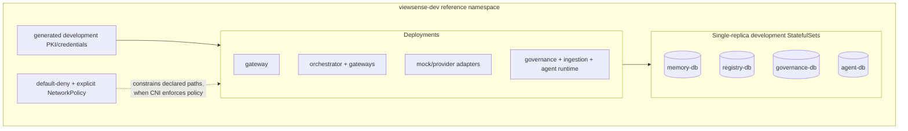
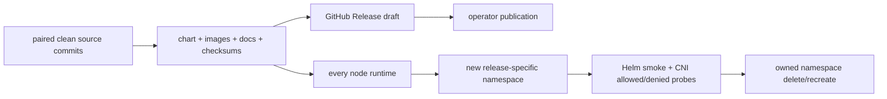
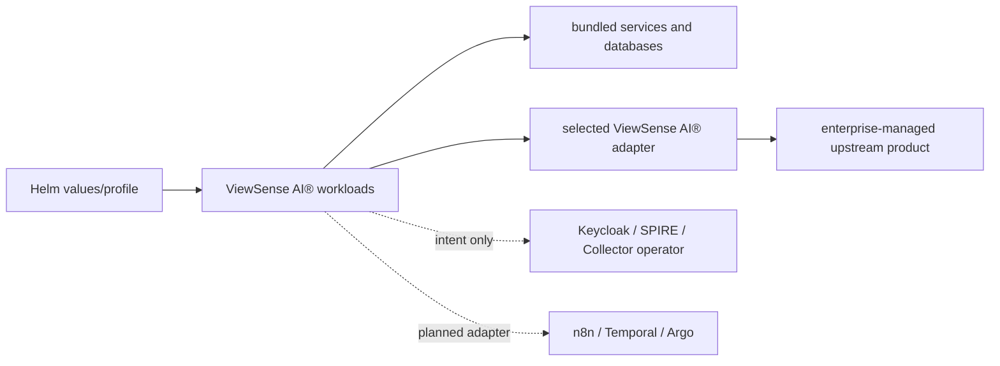

# ViewSense AI® Kubernetes Deployment Design

## Canonical packaging

Kubernetes is the deployment contract. The portable base uses Deployments, StatefulSets, Services, Secrets, PVCs, probes, resource controls, service accounts, and NetworkPolicy. EKS, GKE, AKS, OpenShift, and bare-metal differences belong in overlays. Docker Compose mirrors process/network boundaries only and is not a production topology.

## Namespace and cluster patterns

| Profile | Isolation | Suitable for |
|---|---|---|
| development | one `viewsense-dev` namespace, single replicas | contract and integration testing |
| standard | separate edge/control/provider/data namespaces | normal enterprise production |
| regulated | dedicated provider/data cluster or tenant cell | strict residency and blast-radius controls |
| GPU scale | control cluster plus one or more inference clusters | large model fleets and independent capacity |

The base development manifests touch only `viewsense-dev`. The versioned evaluation installer
uses an explicit `viewsense-release-*` namespace as its environment overlay, with separate
generated PKI/credentials and fixed-version offline images. Production overlays must not reuse
development keys, issuer, mock providers, `imagePullPolicy: Never`, or single-replica databases.

## Downloadable release contract

The [release installation guide](../../../releases/installation.md) defines the 1.0.1
GitHub Release assets: a versioned Helm chart and per-architecture Linux image bundles with
checksums, matching documentation and paired source commits. The image archive includes
PostgreSQL and pgvector, so node installation does not require registry access. Images are
loaded into every node runtime before the chart is installed. The evaluation installer
requires an explicit context, refuses existing namespaces and installs one suite per namespace.
It creates only namespaced application resources; it does not install CRDs or cluster operators.
The Helm smoke workload has a dedicated ServiceAccount and exact HTTPS egress to its seven
reference targets, plus the common DNS rule. Ingestion is an explicit memory-gateway ingress
source, matching the implemented ingestion-to-memory request flow. No direct gateway-to-ingestion
or orchestrator-to-MCP path is allowed by these corrections.

Namespace deletion is available only for the matching release-owned disposable namespace and
uses a UID precondition. Reset waits for deletion, regenerates isolated material and repeats
installation/acceptance. All four database state owners remain unchanged; resetting destroys
their evaluation state, subject to the storage provisioner's reclaim policy. Data-preserving
replacement and production promotion require reviewed environment and migration evidence.

## Workload rules

- one service account and workload identity per component;
- no automatic Kubernetes API token mounts unless a component genuinely calls the API;
- restricted Pod Security, non-root users, read-only roots, no added capabilities;
- default-deny ingress and egress, then explicit source/destination/port policies;
- provider credentials mounted only into the owning adapter;
- topology spread, anti-affinity, disruption budgets, and at least two replicas for stateless production services;
- stateful services use encrypted storage, topology-aware placement, backups, and tested restore.

## Installation sequence

1. Verify context, namespace, admission policies, storage class, ingress, DNS, and network-policy enforcement.
2. Install workload identity/certificate automation and external secret synchronization.
3. Create the ViewSense AI® namespaces and default-deny policies.
4. Install owned data services or bind to managed equivalents, including the isolated governance store.
5. Deploy identity/policy and governance dependencies, provider adapters, control services, then edge.
6. Run conformance and zero-trust negative tests before accepting traffic.
7. Register real providers through audited configuration and remove mocks.

## Product installation modes

- `bundled`: ViewSense AI® deploys and tests the component and owns its lifecycle, such as the bounded
  agent runtime and PostgreSQL/pgvector reference provider.
- `adapter`: ViewSense AI® deploys the contract/credential boundary while the product is separate, such
  as the Mem0 adapter.
- `managed-dependency`: a platform team installs the cluster service with its upstream lifecycle,
  such as SPIRE, an OpenTelemetry Collector, or external secrets.
- `external`: ViewSense AI® configures an authenticated endpoint, such as Keycloak/OIDC, a cloud LLM,
  or a workflow system.

The `enterprise-suite` profile describes integration intent. It does not create cluster-scoped
Keycloak, SPIRE, n8n, or OpenTelemetry operators. OPA can be embedded as a governance sidecar
because it is a stateless local policy decision point with a narrow loopback API. Every external or
managed selection requires credentials, CA trust, explicit egress, conformance tests, version
pinning, upgrade/rollback ownership, and a provider passport before production routing.

The `openai` Helm profile deploys only the ViewSense AI® `openai-adapter`; it does not create or manage
an OpenAI account. Its local default model is read from `config/models.env` and currently resolves
to `gpt-5.6-luna`. The model is non-secret, but the development overlay stores it beside the API key
in the provider Secret so the adapter receives one provider configuration. The model remains
server-controlled. In production the API-key Secret must be supplied by the platform secret
controller, while the model is a Helm value. The development
overlay permits public IPv4 HTTPS while excluding private, loopback, link-local, and reserved
ranges. Production must replace that broad rule with an egress proxy or CNI FQDN policy restricted
to `api.openai.com`, plus DNS/proxy failure tests. `make openai-disable` restores the mock route and
deletes the development credential Secret and adapter resources.

The SPIRE socket/trust-domain and observability endpoint fields are reserved integration intent;
the current chart does not mount an SVID/SDS workload API or configure native application OTLP
export. External OpenAI and Mem0 adapters are the executable provider integrations. Generic
The Ollama adapter is packaged by the opt-in `profiles/local-ai.yaml` Helm profile; approved HTTPS
egress, TLS material, and identity grants are operator requirements. vLLM and workflow selections
still require adapters that have not shipped.

## Sizing method

Control-plane sizing is driven by concurrent requests and provider wait time. Inference sizing is driven by tokens, context length, batching, quantization, and model/GPU class:

$$
replicas = \left\lceil \frac{requests/sec \times average\ total\ tokens}{measured\ tokens/sec/replica \times target\ utilization} \right\rceil
$$

Use load tests from the actual model/runtime; nominal GPU specifications are insufficient. Reserve 25–35% failure/burst headroom for production. Memory-provider sizing includes corpus size, vector dimension, write rate, filter cardinality, index build overhead, and retention. MCP runtimes are sized per connector side effects and external rate limits rather than token load.

## Provider placement and routing

Provider descriptors include locality, residency, classification ceiling, capabilities, and cost class. Routing may cross clusters only through authenticated encrypted endpoints. It must never silently move restricted data from a local route to a public-cloud fallback. DNS names and provider URLs are configuration validated against egress policy.

## Development workflow in this repository

`scripts/k8s-deploy-dev.sh` builds the image, imports it to the active k3d cluster, creates generated Secrets, applies `deploy/kubernetes/base`, and waits for rollout in `viewsense-dev`. It is an installation/update operation, not a routine cluster-start command. An existing stopped cluster resumes with `k3d cluster start cks`, after which Kubernetes restores its workloads and retained volumes. The base includes an independently addressed governance API and database with explicit NetworkPolicy. On an installed suite, `make openai-enable` prompts without echo, reads the non-secret model from `config/models.env`, creates the provider Secret, and applies `deploy/kubernetes/overlays/openai` without rebuilding images; `make openai-enable-fresh` performs the full deployment first. `make openai-model-update` patches only the validated model field and restarts the adapter without reading or replacing its API key. `scripts/k8s-test.sh` runs a namespaced smoke Job that validates provider admission and evidence alongside the core AI path, then pairs reachable and denied in-pod mTLS HTTP data-transfer probes to prove the local CNI enforces two representative NetworkPolicy boundaries. The scripts validate their fixed namespace before mutation. The operator-oriented lifecycle and recovery commands are maintained in the top-level `QUICKSTART.md`.

## Production gaps from the reference

Production requires an ingress/API gateway, enterprise OIDC, SPIFFE/mesh certificates, external secrets, signed immutable images, HA databases or managed data services, autoscaling, PDBs, telemetry collectors, backup schedules, policy engine integration, and GitOps overlays. These gaps are explicit rather than hidden behind the development manifest.

## Local AI profile and isolated console

`make console` runs host-side development APIs at loopback ports 8840–8844 and the GUI on 8787.
`deploy/local-ai/compose.yaml` supplies a dedicated persistent pgvector database on loopback 15432.
The launcher owns separate `.viewsense/local-ai` credentials/PKI and never rotates cluster material.
Stopping APIs retains the database volume; production HA/backup evidence is still required.

The opt-in Helm `profiles/local-ai.yaml` enables the Ollama adapter and real memory embeddings.
Before installing, provide `tls-ollama-adapter`, a `memory-postgres` workload secret/grant to identity
and `embedding.invoke` on `ollama-adapter`, approved upstream TLS/authentication and exact egress
CIDRs. Adapter administration is disabled in Helm. The profile's external egress is empty by default
and therefore denies upstream connectivity. Host `localhost:11434` is not a pod runtime address.
For chat routing additionally select `products.llm.product=ollama-adapter`, its internal endpoint and
audience, grant the LLM gateway `provider.invoke`, and set an approved chat model. No existing base
mock route is silently changed.

## Modular networking reference

The [CNI/mesh design](02-modular-networking-mesh.md) separates portable Service DNS/NetworkPolicy,
provider-owned packet forwarding, mesh transport identity and application JWT/tenant authorization.
The pinned Cilium/Istio ambient reference is a separate two-node cluster with an explicit private
kubeconfig. Upstream privileged node agents live in system namespaces; application pods retain
restricted security and dedicated ServiceAccounts, including four separate database identities.
The existing cks PVCs are not transferred or removed. Install CNI only on an approved empty cluster,
apply STRICT/default-deny mesh policies before enrollment, then verify actual traffic and recovery.
Installation alone is not security acceptance; current evidence and incomplete runtime gates are
recorded in the conformance map. Provider replacement requires a staged cluster/trust/data plan.

## Detachable release preview

The source checkout can attach its host-side GUI to an installed evaluation reference with
`scripts/release/console.py`. This creates only loopback debugging forwards; it adds no Kubernetes
resource, changes no namespace identity or data, and uses existing smoke grants. Twelve API health
checks, ingestion, memory writes and search are supported. These checks do not demonstrate CNI
enforcement and the GUI does not implement production traffic switching. The original 1.0.1
bundle remains a headless distribution; the preview is a follow-up source-checkout utility.

The preview can test the installed mock inference path through the gateway response API without
conversation writes. Real Tev1/Ollama models still require their separate adapter/upstream profile.
