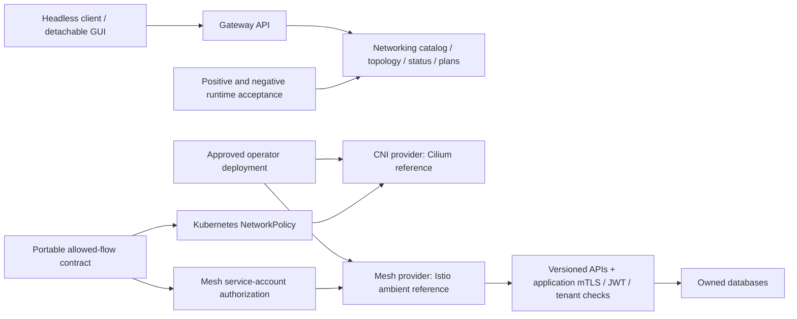

# ViewSense AI® modular networking and service mesh

Change classification: major. Kubernetes Services/DNS, CNI packet forwarding, NetworkPolicy,
service-mesh identity/transport, ingress and application authorization are separate contracts.
Applications address versioned APIs using stable Service DNS and keep their mTLS, scoped JWT and
verified tenant checks. No provider SDK, proprietary mesh header or mesh authorization decision
enters the application data model.

## Provider and ownership boundaries

| Layer | Stable contract | Reference | Replacement acceptance |
| --- | --- | --- | --- |
| Underlay | Kubernetes CNI, Services, DNS and NetworkPolicy | Cilium, kube-proxy retained | allowed/denied pod and Service paths, DNS, cross-node isolation |
| Mesh | workload identity, encrypted transport and allowed service-account flows | Istio ambient / ztunnel | strict peer authentication, identity deny tests, encrypted telemetry, proxy recovery |
| Routing | Service DNS, EndpointSlices and health/readiness | Kubernetes | backend recovery and service reachability |
| Edge/egress | explicit approved destinations, bounded application deadlines | existing edge API and CNI egress | unauthorized egress denied; no implicit retry of model/tool writes |
| Management | versioned metadata/topology/status/plan APIs | gateway networking adapter | same schemas/scopes; no GUI dependency |

A provider-neutral allowed-flow manifest is the source for mesh policy generation. The existing
portable NetworkPolicies remain authoritative for non-mesh ingress/egress. Mesh authorization is
additional and matches exact namespace/service-account/port tuples, including database owners.
A namespace default-deny AuthorizationPolicy plus STRICT peer authentication prevents a valid
certificate for an unapproved workload from implying access. JWT scope/tenant checks remain in
services. Mesh identity is issued by Istio in this reference; it is not SPIRE integration and does
not rotate the existing application TLS files.

The mesh protects opaque TCP because application TLS stays enabled. No plaintext HTTP inspection,
prompt/body logging, guessed L7 routing, automatic model retries or unrestricted egress is added.
Ambient HBONE uses port 15008: its scoped NetworkPolicy exception is paired with exact mesh
identity policy. CNI policy alone cannot inspect the inner encrypted stream. Mesh and CNI proofs
are therefore separate tests; a TCP connect alone is insufficient once a proxy accepts a socket.
Encrypted data transfer and denied reads/writes must be verified, with DNS resolution failures
classified as test failures rather than successful denial.

## Installation and rollout design

Use a dedicated local cluster for first acceptance, with supported pinned Kubernetes/Cilium/Istio
versions and a private kubeconfig. Keep existing POC data and the current kubeconfig context intact.
Install one CNI on an empty cluster; disable k3s Flannel and its competing policy controller before
Cilium starts. Never hot-swap a live cluster CNI. Retain kube-proxy; configure Cilium's CNI coexistence
and socket interception for Istio. Install upstream charts as independently owned releases in
system namespaces. Privileged node agents are cluster networking tools; application namespaces
retain restricted Pod Security, separate ServiceAccounts and least-privilege credentials.

Apply policies before enrolling the application namespace. Ambient enrollment avoids privileged
application init containers and sidecars; Jobs can complete normally. Native Kubernetes network
policies and immutable provider manifests stay outside provider-neutral application source. Any
mesh replacement must regenerate the allowed-flow policy, stage trust and run the same tests.
Do not uninstall mesh controllers while enrolled workloads still require them. Rollback removes
enrollment only after reviewing transport coverage (application TLS remains), and retains CNI
and deny-by-default NetworkPolicy. CNI replacement requires a new cluster and a data migration.

## Management, evidence and failure semantics

Networking APIs expose provider choices, declared topology, selected configuration and bounded,
operator-produced runtime evidence. Evidence includes cluster/context, observed provider versions, topology/provider-profile hashes, test
results and verification time, never kubeconfigs, tokens or payloads. Evidence is explicitly a
last observation, not continuous health. Missing/stale evidence is reported as unverified/stale;
provider selection produces a plan and does not grant the GUI cluster-admin permissions.

The console has a Networking page linking configuration, allowed paths and enforcement evidence.
The backend runs headless and the GUI forwards authenticated calls. Runtime installers and tests
remain explicit operator tools. NetworkPolicy and mesh policies are available directly through
Kubernetes APIs; provider controllers expose their own versioned control APIs.

Initial acceptance must include CNI allowed/denied Service and pod-IP paths across nodes,
STRICT mesh peer enforcement, approved and unapproved service identities, actual application
smoke, database transport, DNS, unavailable-service behavior, workload/proxy recovery and metadata
telemetry. Latency measurements are recorded as POC evidence, not a production SLO guarantee.
For production define load-based p95/p99 budgets, HA control plane, resource sizing, failure-zone
spread, ingress/egress gateways, upgrade canaries, durable telemetry, backups and approved trust.

The original `cks` cluster's empty policy forwarding chain is a failed environment, not a valid
networking provider. The supported cluster is an independently validated reference, not an implicit
migration of its PVCs. Existing SSO/local-AI tools can target it explicitly after migration review.

References: [Kubernetes NetworkPolicy](https://kubernetes.io/docs/concepts/services-networking/network-policies/),
[Cilium with Istio](https://docs.cilium.io/en/stable/network/servicemesh/istio/),
[Cilium on k3s](https://docs.cilium.io/en/stable/installation/k3s/),
[Istio ambient NetworkPolicy](https://istio.io/latest/docs/ambient/usage/networkpolicy/),
[Istio L4 policy](https://istio.io/latest/docs/ambient/usage/l4-policy/),
[Istio supported releases](https://istio.io/latest/docs/releases/supported-releases/).
