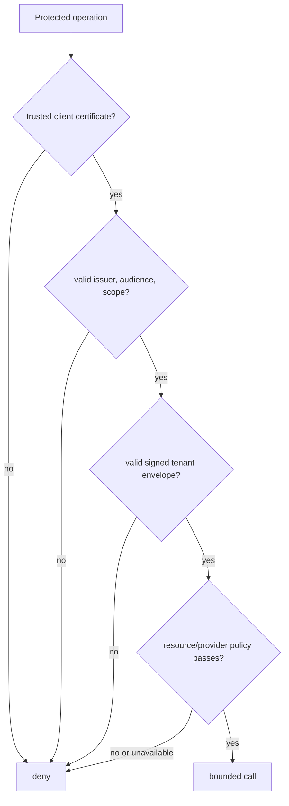

# ViewSense AI® Zero-Trust Security Model

## Security objective

Compromise of one component must not grant implicit access to another component, another tenant, provider credentials, or a different data plane. Controls are layered: network reachability, workload TLS identity, audience/scoped authorization, tenant/data policy, provider egress policy, and audit.

```mermaid
flowchart LR
    Request["Request"] --> Net["NetworkPolicy reachability"]
    Net --> TLS["CA-validated mutual TLS"]
    TLS --> JWT["issuer + aud + scope + expiry"]
    JWT --> Envelope["signed tenant Trust Envelope"]
    Envelope --> Resource["tenant/owner database predicate"]
    Resource --> Provider["configured provider/egress boundary"]
    Provider --> Evidence["JSON log + safe evidence metadata"]
```

In the development reference, the certificate proves possession of a CA-issued client certificate;
the JWT supplies the application workload identity. Binding a SPIFFE ID from the certificate to the
token subject is a production integration, not current application behavior.

## Target trust boundaries and controls

| Boundary | Authentication | Authorization | Containment |
|---|---|---|---|
| client → edge | enterprise OIDC and optional client mTLS | tenant/user RBAC, ABAC, quota | ingress/WAF and no direct internal exposure |
| edge → orchestrator | workload mTLS + audience token | `orchestrate.invoke` | explicit NetworkPolicy |
| orchestrator → gateway | workload mTLS + audience token | capability-specific scope | no provider credential in orchestrator |
| gateway → provider | workload mTLS + provider audience | `provider.invoke`, provider policy | dedicated provider network/namespace |
| OpenAI adapter → OpenAI | server-held API key + HTTPS | provider project/model limits | adapter-only Secret and constrained public egress |
| provider → database | database identity and TLS | owner schema/user only | only owning provider can reach store |
| MCP → enterprise system | connector workload identity | per-tool/action/data policy | egress allow-list and isolated credentials |

## Identity

Human identity federates to the enterprise IdP using OIDC Authorization Code + PKCE or workload-appropriate OAuth flows. Workloads receive renewable, short-lived identities through SPIFFE/SPIRE, service mesh, or cloud workload identity. Application tokens have exact `aud`, narrow scopes, expiry, unique ID, and issuer. Shared bearer tokens, namespace trust, and long-lived API keys are prohibited.

The development issuer uses client credentials and RS256 plus a generated CA to make these properties testable. It is not an enterprise IdP and must not be promoted. At the edge, the external OIDC verifier pins an HTTPS issuer and JWKS URL, exact audience, supported signature algorithms, required scopes, subject, and configured tenant claim. Keycloak is one compatible IdP, not a mandatory control-plane component. JWKS/IdP unavailability fails authentication closed.

SPIRE is a cluster workload-identity authority, not an application library or proof of authorization.
Production installs its server/agent lifecycle separately, maps each service account to a unique
SPIFFE ID, rotates SVIDs, and presents them through an SDS-capable proxy or service mesh. ViewSense AI®
still requires exact token audience/scopes and tenant policy after mTLS succeeds.

The shipped development manifests use separate service certificates and credentials, disable
service-account token mounts, and require TLS for application APIs. PostgreSQL connections in the
development base use password authentication and NetworkPolicy but are not TLS-enabled; production
must supply database TLS verification, rotated credentials, and encrypted storage before acceptance.

## Tenant, Trust Envelope, and authorization

The edge derives tenant from verified claims. Tenant and business context are signed claims, never an unsigned transport header. Trust Envelope v1 binds tenant, delegating workload, subject, purpose, classification, request correlation, audience, scopes, and expiry. Only registered delegators may request tenant-bound downstream tokens; fixed-tenant clients cannot change tenant. Receivers reject legacy tenant headers, missing envelopes, audience mismatch, inconsistent top-level/envelope tenants, and unsupported versions.

Production uses standards-based token exchange or equivalent workload delegation while retaining the ViewSense AI® envelope schema. Each hop obtains a new audience token rather than forwarding a human token or mutable context header. Data queries include tenant and owner/purpose predicates. Production adds policy decisions for classification, legal basis, retention, model class, connector action, and residency both before retrieval and after candidate retrieval.

Provider admission may consult OPA through its Data API. The bundled OPA profile runs a policy
sidecar in the governance pod; policy input contains provider metadata and requested constraints,
not credentials or payloads. Timeout, malformed response, non-success response, missing result, and
explicit deny all fail closed. OPA does not replace API authorization or workload identity.

## Provider and evidence trust

Provider passports are untrusted assertions until signature, provenance, evaluation, ownership, expiry, residency, and policy checks succeed. Admission is time-bound and revocable. An admitted provider receives no credentials until workload identity and egress policy also allow the connection.

Evidence APIs accept payload-minimized metadata only. Append-only API semantics do not make the reference PostgreSQL database an immutable audit store; production exports to an independently controlled integrity and retention system.

## MCP threat model

MCP servers and returned content are untrusted. Controls include exact HTTPS host allow-lists, signed/approved server descriptors, schema validation, bounded payload/time, side-effect classification, human approval for consequential actions, response content isolation, SSRF/DNS rebinding protection, separate credentials, and immutable invocation audit. A catalog record is not execution approval.

## AI-specific threats

- Prompt injection: retrieved/tool content is marked as data, tools are authorized independently of model output, and high-risk actions require deterministic policy or approval.
- Data exfiltration: outbound providers are chosen by data policy; payload logging is off by default; egress is deny-by-default.
- Cross-tenant retrieval: tenant predicates, provider-level isolation, negative tests, and post-retrieval policy filters.
- Cost/resource exhaustion: input/output/tool-loop limits, quotas, deadlines, concurrency controls, and cancellation.
- Model/provider substitution: signed configuration, capability/residency validation, immutable image digests, and audited route decisions.

## Secrets and cryptography

Production secrets originate in Vault or a cloud secret manager, arrive through workload identity, rotate automatically, and are never present in Git or images. Certificates are short-lived and automatically renewed. Databases, backups, and object storage use enterprise-managed encryption keys. Algorithms and issuers are configuration with a tested rotation/overlap procedure.

The development OpenAI key is entered through a non-echoing terminal prompt and piped to a
namespaced Kubernetes Secret without appearing in command arguments or repository files. Only the
adapter pod references that Secret. Application logs never include request bodies, authorization
headers, upstream error bodies, or the key. Production replaces this manual Secret with external
secret synchronization, provider-side project restrictions, rotation, usage alerts, and immediate
revocation procedures.

## Supply chain

CI generates SBOMs, scans dependencies/images/IaC, signs artifacts and provenance, and admits only trusted digests. Pods use restricted security contexts. Provider and MCP adapter additions require threat modeling, conformance tests, and review of their network and secret permissions.

## Required negative tests

Release evaluation namespaces use independent CA/signing/client/database material and retain
default-deny policy. The Helm test workload has exact namespaced HTTPS egress to its declared
test targets. Ingestion is allowed into the memory gateway because it owns that documented call;
other undeclared application edges remain denied. Parallel isolation probes temporarily grant
only an exact source/target namespace, pod identity label and port, prove the transport control,
remove the grants and re-prove denial. Independent mTLS/tenant authorization still applies.
See the [release simulation guide](../../../releases/parallel-environments.md).

- missing/expired token, wrong audience, wrong scope, and untrusted client certificate;
- caller-supplied tenant substitution and cross-tenant memory search;
- missing/malformed Trust Envelope, fixed-tenant delegation attempt, and legacy tenant header;
- expired/revoked/unevaluated provider admission and sensitive evidence metadata;
- disallowed MCP URL, DNS/IP/redirect SSRF cases, and undeclared tool;
- direct orchestrator-to-provider/database network attempts;
- provider credential absence in callers;
- policy/identity unavailability fails closed for protected operations.
- OIDC wrong issuer/audience/algorithm, missing tenant/scope, stale key, and JWKS outage;
- OPA timeout/malformed/deny and SPIFFE ID/SVID rotation or spoof failures;
- agent approval with `agent.run` only, stale version replay, invalid state transition, and budget exhaustion.
- OpenAI key absent/revoked, upstream 401/429/timeout/malformed response, caller model override,
  upstream URL/redirect manipulation, direct non-adapter egress, and credential absence from all
  gateway/orchestrator pod specifications and logs.

## Local AI development console boundary

The loopback GUI uses a fragment bootstrap credential exchanged for an HttpOnly SameSite session,
strict Host/Origin checks, same-origin JSON and an anti-CSRF header. Its fixed development tenant
comes from the console workload identity; users cannot supply tenant headers or service credentials.
Internal console → adapter/memory and memory → embedding calls use mTLS, audience/scoped tokens and
signed delegation. Model selection uses an opt-in `provider.admin` API; the GUI cannot set arbitrary
upstream URLs, download weights, run shell commands or read provider databases.
Selected-model previews at `/v1/model-tests` also require `provider.admin` and opt-in model
management. The adapter checks the installed inventory and declared capability before inference;
normal inference routes reject caller model substitution. Previews never modify saved defaults or
memory profiles, and test success does not constitute production admission.

Plain HTTP to Ollama is permitted only in explicit development mode for a literal loopback host.
Kubernetes/production adapters require approved HTTPS hosts and egress, trusted TLS and configured
upstream credentials/identity. Decision model probabilities never authorize tool actions or bypass
access policy. POC GUI SSO and mapped roles are implemented; HA sessions, workload rotation and audited configuration promotion remain
production gaps. See [console design](../10-overall/06-local-ai-console.md).

## Headless access-management boundary

Role/membership administration belongs to the enterprise IdP's authenticated APIs and authorization
policy to the policy owner's decision/lifecycle APIs. GUI removal must not affect either.
The development issuer's fixed grants file is not an implemented user/role management service.
The local API test workload has its own client certificate, fixed signed tenant and scoped grants;
it never uses browser cookies or reads a service database. Model-favored answers are evidence,
not access authorization. See the [headless API matrix](../design_01.md#platform-wide-headless-api-requirement).

## Enterprise SSO and certificate administration redesign

Provider configuration is an operator control, not a caller-selected issuer or discovery URL.
Access tokens require pinned signature algorithm, issuer, audience, expiry, subject and tenant.
External role claims map through an explicit allowlist to platform scopes; unrelated IdP roles
grant nothing. JWKS caching is bounded and unknown keys refresh; failures deny access. PKCE/state/
nonce bind browser login to one short-lived, single-use session. Browser tokens/client secrets
stay server-side; sessions expire with the access token and no local launch-key bypass is allowed
when SSO is enabled. Role changes take effect at the next access-token issuance/expiry.

`certificates.read` and `certificates.renew` are separate operator privileges. Inventory is a
platform administrative surface restricted to configured namespaces, not tenant-selectable
resource access. Renewal accepts a resource version and only changes the Issuing status condition
on an approved namespaced Certificate; stale versions fail with 409. There is no Secret, private
key, arbitrary URL/path, issuer mutation, namespace mutation or deployment restart API. The
certificate service account has Certificate read and status patch permissions only. Dedicated
NetworkPolicy permits its Kubernetes API connection and only authorized harness callers.

Expiry and renewal audit logs contain resource identity, expiry, outcome and request correlation;
never key material or bearer tokens. cert-manager availability, incomplete inventory and expired
certificates are visible failures. Existing CNI denial regression remains a production blocker.

The POC certificate Role further restricts status patch to `viewsense-managed-canary`; the API's
renewable-name allowlist, approval label and non-CA check must all agree. Adding a managed leaf
requires an operator to update both RBAC and the API allowlist. External certificate-only bridge
credentials are separate from local workload tokens. No credential/key material reaches the GUI.
The public HTML landing page permits top-level cross-site GET navigation after validated OIDC
callback; cross-site API/mutations remain denied and the callback requires bound single-use state.
HTTPS browser clients use Secure cookies and a registered origin; HTTP is development loopback only.

## Networking trust boundary

The mesh provider issues renewable transport identities bound to exact Kubernetes ServiceAccounts.
Default-deny mesh authorization is additive to CNI policy and application scopes/tenants. Privileged
CNI/ztunnel tooling runs in system namespaces; applications retain restricted Pod Security. Ambient
HBONE requires scoped port 15008 policy; inner authorization must be proven through data transfer,
not only TCP connect. No prompt/body logs or automatic model-write retries are introduced. See the
[networking design](../20-deployment/02-modular-networking-mesh.md).
