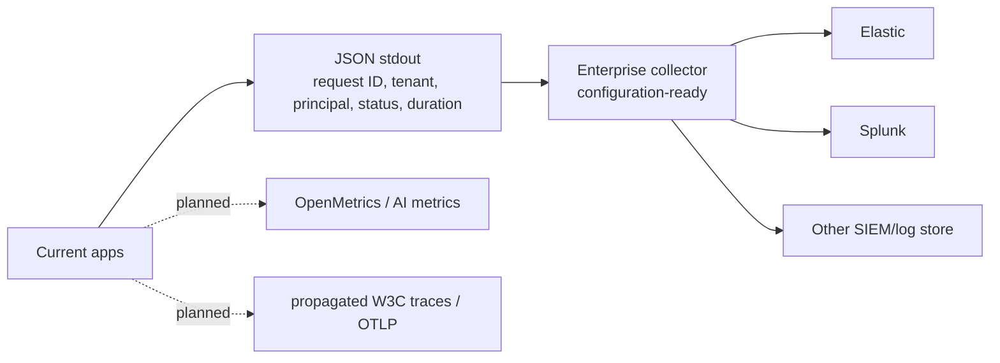
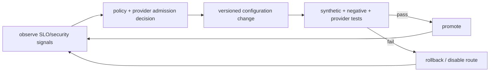

# ViewSense AI® Day-2 Operations and SRE

## Observability: current and target

The implemented middleware emits one JSON object per request and propagates `X-Request-ID`.
It records an inbound `traceparent` value but the service client does not yet forward it. The
reference does not expose OpenMetrics or native OTLP. Production requires propagated traces,
tenant pseudonymization, route/provider and retry fields, RED/USE plus AI metrics, and a collector.
Prompt, completion, memory, and tool bodies remain excluded from baseline logs.

## SLOs and dependency budgets

Define SLOs separately for edge/control overhead, memory, each model route, and each MCP class. End-to-end alerts use multi-window error-budget burn. A provider outage must identify the dependency instead of presenting as generic orchestrator failure. Route changes and degraded no-memory operation are visible events.

The local Qwen chat preview allows a 240-second total provider deadline and 260-second console hop,
with connect timeout 5 seconds. A minute-long cold/large-model response is visible as elapsed wait
time, not a hung success indicator. Native chat token counts and load/prompt/generation durations
are transient result metadata. Production routing must align every enclosing gateway/orchestrator
budget; current public-route timeouts do not certify the slow Qwen path.

## Release safety

The source trigger can request automated packaging and a GitHub draft after a reviewed `main`
change. It pins docs, runs validation before building both architectures, verifies clean paired
source/checksums and never moves existing version tags. A failed upload job can reuse its retained
build artifact and add only missing matching draft attachments; publication remains explicit.
Completed versions are skipped and unrelated commits do not retrigger an unchanged enabled file.
Repository token/policy configuration and remote-run evidence are prerequisites. This workflow
does not deploy or prove live CNI/model quality; use the
[trigger and recovery guide](../../../releases/installation.md#automate-a-release-with-the-trigger-file).

The 1.0.1 evaluation distribution supports fresh release-specific namespace installation,
Helm smoke tests, CNI probes and owned namespace delete/recreate. The release-owner scripts
record paired source commits, build checksummed per-architecture downloads and upload a GitHub
Release draft. See the [release guide](../../../releases/installation.md). Parallel blue/green
environments use the [replacement and traffic-switching plan](../../../releases/parallel-environments.md).
An evaluation reset destroys its state; production cutover must reconcile state, workload
trust and sessions, drain requests/work and define a data-safe fallback before old resources retire.

- immutable signed image digests and GitOps promotion;
- contract tests against every configured adapter;
- expand/migrate/contract database changes with rollback compatibility;
- canary by non-sensitive synthetic tenant, then explicit pilot tenants;
- rollback on security regression, error-budget burn, latency, or output-quality gate;
- configuration rollout and application rollout independently reversible.

## Backup and disaster recovery

Each state owner defines RPO/RTO, encryption, retention, legal hold, restore order, and integrity verification. PostgreSQL uses PITR plus regular full backups. Vector records retain enough canonical source/embedding metadata to reindex. MCP catalog backups exclude retrievable secrets. Restore tests run monthly in an isolated environment; regional/cluster failover is exercised quarterly for required tiers.

The agent database is a separate state owner. Restore it before resuming workers, hold all restored
runs paused until version/idempotency reconciliation completes, and never infer that a side effect
must be repeated merely because an event is absent. Mem0 backup/export, Keycloak realm recovery,
SPIRE trust-bundle recovery, OPA bundle rollback, and workflow recovery remain owned by their
selected product operators and must be tested with the ViewSense AI® conformance suite.

## Incident playbooks

- suspected cross-tenant retrieval: stop affected route, preserve audit evidence, revoke identities, assess all provider copies;
- compromised MCP connector: disable catalog entry, block egress, revoke connector credentials, inspect invocation history;
- provider credential leak: revoke at provider, rotate secret source, invalidate pods/tokens, check usage audit;
- token runaway: cancel request/workflow, enforce tenant stop-loss, quarantine route;
- model quality/safety regression: pin previous provider/model policy, preserve evaluation evidence, notify owners.

For an OpenAI route, 401/403 indicates credential/configuration failure and pages the route owner;
429 is a capacity/quota signal and must not cause residency-unsafe fallback; timeout/5xx consumes
the provider dependency budget. Rollback runs `make openai-disable` in development or promotes the
previous signed route configuration in production. Rotate/revoke the provider key at OpenAI first,
then synchronize the secret and restart only the adapter; verify callers and logs never contain it.
The local OpenAI model default is controlled by `config/models.env` and currently resolves to
`gpt-5.6-luna`. Changing that default requires replaying representative
memory-grounding, safety, latency, token-usage, and output-contract evaluations before promotion;
rollback restores the last admitted model value without changing the stable ViewSense AI® API.

## Capacity and cost

Review GPU saturation, batching, KV-cache pressure, database index health, queue depth, connector external quotas, and tenant cost weekly. Enforce per-tenant concurrency, token, memory-storage, and tool budgets. Cost-based routing is evaluated only after capability, security, residency, and SLO constraints.

## Operational readiness gate

No production provider is enabled until it has ownership/on-call, dashboard and alerts, SLO, capacity test, failure-mode test, security review, data-flow record, backup/restore where stateful, credential rotation, and rollback/disable instructions.

Provider readiness is represented by an expiring passport plus evaluation/admission records. The
reference governance API evaluates admission, but gateways do not yet consult admission state when
routing and no expiry alert controller is shipped. Production must add that reconciliation/enforcement
loop, alert before expiry, block revoked/expired routes, back up governance state, and export evidence
to an independently administered immutable sink.

Database-owning services use bounded startup retries because Kubernetes readiness ordering does not
guarantee that a newly reachable database is accepting connections. Exhaustion fails startup and is
visible through JSON logs and readiness. Development rollouts restart services sequentially to avoid
an all-service surge on a small cluster; production availability strategy is defined by its overlay,
capacity budget, disruption budget, and tested rollback.

Trust Envelope failures are separated into missing context, unsupported version, tenant inconsistency, delegation denial, expired token, wrong audience, and insufficient scope. They are security signals and must not trigger fallback to an unsigned header or a less-restricted provider.

Product readiness is read from `fabric/product-catalog.json`: `validated` has repository evidence,
`configuration-ready` has an executable ViewSense AI® integration boundary but needs the selected
environment, and `planned` is declaration-only. Render every profile with `make profile-check`.
Never report a profile as installed merely because Helm accepts its values.

## Operational control loop

## Local embedding profiles and GUI operation

The development console shows actual dependency health separately from repository capability.
`memory_embeddings` retains model/revision/dimension profiles while the legacy 64-d column remains
available for rollback. Real writes are atomic with records; queries fail with 409 when an owner's
active-profile coverage is incomplete. `POST /v1/memories:reembed` is an owner/tenant-bound bounded
backfill; repeat batches until `remaining=0`. It skips already completed vectors, retains older
profiles, and makes model calls outside DB leases. Old-profile rollback requires restoring the
adapter model revision/configuration; profile changes must not silently mix vector spaces.
The provider enforces a 110-second batch deadline. A timed-out batch retains committed vectors;
retrying resumes missing records. The isolated launcher preserves valid development PKI and credentials on restart, renewing
certificates with less than one day remaining. This lets an attached GUI reconnect without
being stopped. GUI-only attach never changes this material.
The base development bootstrap now checks CA and leaf expiry before reusing existing material;
renewal preserves database passwords and stored data.

Use synthetic data for GUI tests. Request history and JSON logs contain IDs, operation, outcome and
duration only; raw test results are an explicit transient diagnostic view. Stop host APIs with
Ctrl+C and restart using `make console`; pgvector data persists. The GUI does not provide immutable
audit, enterprise SSO, full tracing, ANN indexes, HA or automated backup/restore. Production migration
jobs, load/quality tests and operator-controlled routing promotion remain acceptance gates.

Use the test lab's model dropdown, Test model, and Save as default to promote local selections.
The preview records no memory and changes no default; embedding dimensions are discovered from a
validated response. All installed models are shown with capabilities, and known incompatible options
are disabled. RAG/Search/Ingestion/Backfill remain on the saved profile. Configuration-page saves
remain explicit operator changes; production model promotion requires its admission/evaluation gates.

The local harness supports API-only startup and an independently attached GUI, with direct mTLS/
scoped-token component tests and additive binary decision probabilities. See the
[detachable API harness contract](../10-overall/06-local-ai-console.md#detachable-local-api-harness).

## SSO and certificate operating model

Operate Keycloak and cert-manager independently. Use pinned upstream releases for the POC and
upgrade after provider/API acceptance tests. IdP configuration is loaded at process start from a
private operator file; roll the edge and optional console together for mappings/issuer changes.
Preserve the development launch mode when SSO is not configured; enabling SSO disables launch-key
authentication. No IdP outage fallback to the development issuer is permitted.

Certificate inventory exposes not-before/not-after, renewal time, readiness, management source
and expiry severity. Periodic structured logs record expiry-state changes and incomplete scans;
an authenticated OpenMetrics endpoint enables external alerting. A renewal response is 202
accepted, not rotation complete: poll the Certificate revision/readiness, then perform a controlled
workload restart and TLS handshake verification. CA trust rotation is a staged overlap process.

The POC deliberately retains static service PKI and adds cert-manager managed canary issuance/
renewal. Production requires an approved CA/issuer, root backup/offline custody, trust-manager or
equivalent trust distribution, workload reload automation, durable audit export and HA IdP storage.
Do not uninstall cert-manager as rollback: its CRDs own resources. Disable harness integration
and leave issued Secrets/Certificates intact while planning migration.

The [SSO/certificate POC guide](../../../deploy/integrations/keycloak.md) documents startup,
separate pod/PVC lifecycle, forwards with pod-rollout reconnection, private operator credentials,
API scopes, integration rollback and production gaps. Expiry warning is seven days, critical is
24 hours and expired is zero. Suite selection generates a plan and does not apply Kubernetes.
The POC source inventories explicitly distinguish local AI and Kubernetes environments.

## Networking operations

Use the [networking guide](../../../deploy/integrations/networking.md) for separate-cluster
startup, provider upgrades, recovery tests and replacement. Networking inspection and plans have
versioned APIs; operator/GitOps deployment owns cluster changes. The GUI cannot run installers.
Read the actual cluster identifier, topology hash, check timestamp and completeness before relying
on evidence. Results expire after ten minutes and never claim continuously monitored health.
The acceptance suite pairs denied paths with successful controls, resolves DNS separately, transfers
real bytes, observes mesh identities on database traffic, tests unavailable services and restarts
a workload/proxy. Failed or interrupted runs publish failed evidence. Production alert routing,
load-based latency budgets, trust rotation, HA and durable telemetry remain separate gates.
Istio owns its workload certificates; the certificate inventory does not yet integrate mesh-issued
ephemeral certificates. Plaintext Cilium metrics are disabled in the provider profile until an
authenticated collector is approved; Hubble relay uses TLS and no public telemetry UI is enabled.

## Release preview lifecycle

A workstation operator can attach the source-checkout GUI to one owned evaluation namespace
using `make release-console`; see the [release guide](../../../releases/installation.md#attach-the-host-side-release-preview-gui).
It starts only loopback port-forwards and a host GUI, retaining existing namespace state and
workload grants. Ctrl+C stops those processes and removes temporary credentials. A namespace
reset requires reattachment. Service health in this GUI is live mTLS reachability through a
Kubernetes debugging path; headless smoke and CNI-negative tests remain independent gates.
The old development namespace and local Ollama harness have separate recovery lifecycles.
