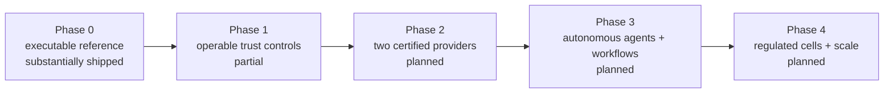

# ViewSense AI® Delivery Roadmap and Maturity

## Delivery strategy

Build thin end-to-end slices and prove replaceability/security with tests before adding providers. Dates depend on enterprise controls and provider choices; exit criteria, not elapsed weeks, determine readiness.

## Phase 0 — executable contract foundation (current)

Deliver edge, orchestrator, LLM/memory/MCP gateways, mock providers, PostgreSQL/pgvector memory,
the Mem0 adapter boundary, persistent bounded agent lifecycle, development workload identity,
Kubernetes packaging, network policy, product profiles, and smoke tests.

Exit: a clean cluster can deploy into an isolated namespace; missing authorization is denied; model, persisted memory, and MCP paths pass end to end.

## Phase 1 — trustworthy control foundation

Shipped portions are signed Trust Envelopes, provider passport/evaluation/evidence APIs, committed
JSON schemas, external OIDC verification, and an OPA admission boundary. Remaining work includes
standardized errors/idempotency/deadlines across all APIs, runtime enforcement of admission,
separate signed images/SBOMs, an operator skeleton, IdP conformance, SPIFFE/mesh identity
consumption, database TLS, external secrets, OpenTelemetry, GitOps overlays, PDB/HPA, and HA data
services.

Exit: header-based tenant spoofing is denied; identity/key rotation, provider admission/revocation, evidence export, negative security tests, telemetry continuity, backup/restore, rolling upgrade, and rollback pass in staging.

## Phase 2 — real replaceable providers

The immediate product priority is the local AI slice detailed in the
[project status and local AI integration plan](../01-project-status-and-local-ai-plan.md): connect
local inference, connect real local embeddings behind the PostgreSQL memory provider, migrate
existing vectors, then prove the full local retrieval-to-answer flow and enterprise controls.
The existing cloud adapter is optional; it does not satisfy the local inference or embedding gates.
The Ollama adapter, local development console, real-profile pgvector writes/search and bounded owner
backfill now implement the first local slice. Decision/embedding/RAG connectivity has live reference
evidence; provider quality certification, optional chat acceptance and enterprise promotion remain.

Add and certify at least two LLM routes (one local, one cloud or second local), a real embedding provider, certify Mem0 against deployed OSS/Platform versions, add memory export/import, and complete isolated MCP server lifecycle.

Exit: the same consumer conformance suite passes against each provider; a policy-only route/provider swap needs no caller deployment and preserves tenant/residency guarantees.

## Phase 3 — durable agents, workflows, and governance

Extend the shipped agent-run contract/checkpoints/approvals with autonomous workers, transactional
flight-recorder export, and side-effect replay protection. Add the workflow-provider contract,
n8n/Temporal/LangGraph adapters as selected, resumable ingestion jobs, provider catalog lifecycle,
evaluation service, prompt/config versioning, data retention/legal hold, chargeback, and an admin API/UI.

Add an A2A gateway only after agent identity, delegation narrowing, remote passport validation, recursion budgets, and evidence correlation pass conformance tests.

Exit: replay-safe workflows, bounded tool loops, audited approvals, and tenant onboarding/offboarding drills pass.

## Phase 4 — scale and regulated cells

Add multi-cluster routing, GPU fleet integration/autoscaling, regulated tenant cells, DR/failover automation, performance/cost optimization, and continuous red-team/evaluation gates.

Exit: stated SLO/RPO/RTO and isolation targets pass load, chaos, restore, failover, and security exercises.

## Maturity levels

| Level | Evidence |
|---|---|
| executable | one reference path and automated negative/positive tests |
| replaceable | two implementations pass the same contract suite |
| operable | SLOs, telemetry, upgrade/rollback, backup/restore, on-call |
| governed | policy/audit/data lifecycle and certified provider catalog |
| resilient | HA, failure isolation, DR and multi-cluster exercises |

## Principal risks

1. Treating OpenAI-compatible syntax as full semantic compatibility; mitigate with capability descriptors and conformance/evaluation tests.
2. Memory-provider lock-in through opaque embeddings/metadata; mitigate with canonical export and re-embedding plans.
3. Prompt injection causing tool actions; mitigate with independent deterministic tool authorization and approval.
4. Static development security being promoted; block production overlays that reference the dev issuer/CA/mocks.
5. Kubernetes NetworkPolicy support varying by CNI; verify enforcement, do not infer it from accepted YAML.
6. Unbounded provider fallback violating residency; route only among policy-equivalent providers.
