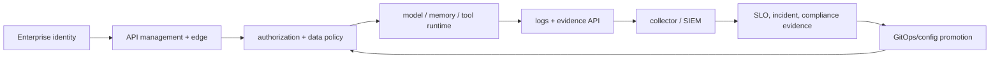
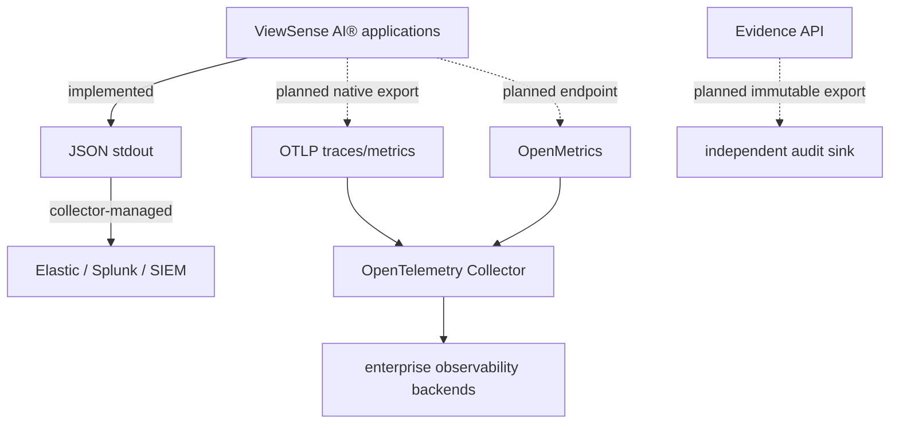

# ViewSense AI® Enterprise Integration and Control Matrix

This document is the acceptance checklist for an enterprise installation. A feature is “catered for” when ViewSense AI® defines its boundary and integration contract; a production deployment is ready only when the enterprise-selected implementation is configured and the evidence test passes.



The table below is a production acceptance contract. It is not a list of capabilities already
implemented by the reference.

| Domain | Required capability | Integration contract | Acceptance evidence |
|---|---|---|---|
| SSO | OIDC federation, MFA/conditional access at IdP, group/role claims | standard OIDC discovery/JWKS; issuer/audience/claim mapping config | login, logout, expiry, group change, disabled user, wrong issuer/audience tests |
| workload identity | unique renewable identity per component | SPIFFE/mesh/cloud workload identity and mTLS | peer spoof/expired cert tests and automated rotation |
| authorization | RBAC plus resource/data ABAC | policy decision API/bundle with subject, tenant, action, resource, classification, purpose | allow/deny matrix, policy outage fail-closed, decision audit |
| secrets | dynamic/rotated provider and database credentials | Vault/cloud secret manager through workload identity | no Git/image secrets, revocation and rotation drill |
| API management | validation, quotas, rate limiting, WAF, version policy | OpenAPI import plus gateway-neutral policy requirements | malformed/oversize/rate/tenant abuse tests |
| logging | structured JSON Lines on stdout/stderr from every container | stable field schema; collector via Kubernetes/OTel agent | schema validation and ingestion into chosen backend |
| SIEM | Elastic, Splunk, Sentinel, or equivalent | OTel Collector/Fluent Bit/Vector routing; JSON remains vendor-neutral | search by request/trace/tenant pseudonym and security alert drill |
| metrics | RED/USE and AI-specific metrics | Prometheus/OpenMetrics through OTel Collector | dashboards, recording rules, burn-rate alerts |
| tracing | distributed traces across edge, memory, model, workflow, and MCP | W3C Trace Context and OTLP | one request visible end-to-end with dependency timings |
| security audit | immutable auth, policy, model route, memory admin, MCP, and configuration events | versioned audit-event schema to append-only sink | completeness/replay check, tamper/retention controls |
| data governance | classification, purpose, retention, deletion, legal hold, residency | mandatory metadata and policy hooks on ingest/retrieve/export | retention/deletion/hold and cross-region deny tests |
| privacy | payload minimization, masking/tokenization, access-controlled diagnostics | logging classes and redaction policies | PII canary absent from standard logs and traces |
| model governance | approved catalog, version, capabilities, evaluations, route rationale | provider descriptor and evaluation/promotion API | unapproved model denied; rollback and quality gate |
| MCP governance | catalog, certification, scopes, side effects, approval, egress | MCP gateway administration/invocation contracts | SSRF, injection, undeclared tool, approval, credential isolation tests |
| supply chain | SBOM, signing, provenance, vulnerability/admission policy | OCI artifacts and standard attestations | unsigned/vulnerable image admission is denied |
| resilience | HA, PDB, topology spread, backup, PITR, DR | Kubernetes overlays and state-owner runbooks | node loss, rolling upgrade, restore, region/cluster exercise |
| operations | SLOs, ownership, runbooks, incident/change management | OTel data plus enterprise ITSM/on-call webhooks/APIs | alert-to-ticket/page and incident exercise |
| cost | tenant/provider/token/storage/tool attribution and limits | usage event schema and export API | showback reconciliation and tenant stop-loss test |
| lifecycle | tenant/provider onboarding, offboarding, export, deletion | idempotent admin APIs and GitOps workflows | complete offboarding and credential/data cleanup evidence |
| provider admission | expiring passports, capabilities, evaluations, residency, provenance and revocation | provider passport/evaluation APIs plus policy decision | expired/revoked/unevaluated provider cannot receive new traffic |
| execution evidence | payload-minimized lineage and decision events | append-only evidence API and immutable export | reconstruct route/policy/approval sequence without sensitive payloads |

## Target JSON log schema

Application containers write one JSON object per line and never write multiline human-formatted
access logs. The reference middleware emits the shape below; the timestamp placeholder represents
the event's RFC3339 timestamp generated at runtime.

```json
{
  "timestamp": "<RFC3339 timestamp>",
  "level": "info",
  "service": "gateway",
  "environment": "production",
  "logger": "viewsense.http",
  "message": "request_completed",
  "event": "http_request",
  "request_id": "...",
  "traceparent": "...",
  "tenant_id": "pseudonymous-tenant-key",
  "principal": "workload-or-user-key",
  "http_method": "POST",
  "http_path": "/v1/responses",
  "http_status": 200,
  "duration_ms": 42.1,
  "outcome": "success"
}
```

The current middleware emits this core shape but uses the verified development tenant ID and
principal rather than a production pseudonym, does not add route/provider or retry fields, and only
records inbound `traceparent`. Production must pseudonymize identifiers and enrich missing fields in
the application or collector without exposing payloads.

Collectors read container stdout using the Kubernetes metadata API and enrich with cluster, namespace, pod, image digest, node, and region. Routing can use OTLP, Elastic Common Schema transforms, Splunk HEC, or another sink-specific exporter. Applications do not embed Elastic/Splunk SDKs, preserving backend replaceability.

Secrets, tokens, authorization headers, raw prompts/completions, memory content, tool arguments/results, and personal data are prohibited in the baseline log class. Security audit events and diagnostic payload capture use separate access, encryption, retention, and approval policies.

## SSO and identity boundary

The edge validates external enterprise tokens against configured issuer/JWKS and maps stable subject, tenant, groups, authentication strength, and session risk. Internal services never accept human tokens as workload identity; the edge performs controlled delegation with a short-lived audience token. SCIM may automate user/group provisioning, but authorization remains based on current verified claims and policy. Break-glass identity is separate, time-bound, approval-gated, and always audited.

Keycloak is an approved integration choice, not part of the mandatory core. Use the official
Keycloak Operator or an existing enterprise service, then configure only issuer/JWKS/audience/claim
mapping in ViewSense AI®. SPIRE is similarly operated at cluster scope. OPA is suited to a local sidecar
for low-latency fail-closed decisions, while a centrally managed external OPA endpoint is appropriate
only when its availability, mTLS, egress, and policy-bundle lifecycle meet the protected operation's
SLO.

## Suite selection rule

Every product is classified as bundled, adapter, managed dependency, or external and separately as
validated, configuration-ready, or planned. The machine-readable source is
`fabric/product-catalog.json`; Helm profiles are curated configuration, not evidence of an upstream
installation. Production acceptance requires the named conformance and failure tests in addition to
successful rendering.

## Telemetry deployment pattern



Today the integration boundary is JSON container stdout, which a platform-managed OpenTelemetry
Collector, Fluent Bit, or Vector deployment can ingest. `products.observability.otlpEndpoint` is
reserved intent and is not consumed by application code. Native OpenMetrics, propagated traces,
OTLP exporters, sampling, delivery acknowledgement, and fail-closed audit delivery are planned.

## Current reference status

The follow-up release workflow separates read-only validation/build from contents-write draft
upload, pins the documentation commit, verifies hashes/source bindings, and uses a distinct token
scoped to the docs repository for its matching tag. Reviewed `main` trigger changes request a
release; existing tags and published assets are preserved. Failed-job retries reuse retained
artifacts, and real GitHub execution remains environment-dependent. These checks do not satisfy
the matrix's SBOM/signing/provenance or production deployment gates.

The 1.0.1 distribution provides paired source commits, fixed-version Helm packaging,
architecture-specific offline images, checksum verification and an explicit draft-publication
step. Evaluation environments use release-specific namespaces and separate credentials/state,
with acceptance before retirement or traffic promotion. See the
[release guide](../../../releases/installation.md) and
[parallel environment contract](../../../releases/parallel-environments.md). This does not
implement signed supply-chain attestations, enterprise data migration, shared identity/session
cutover or a production traffic controller; those matrix acceptance gates remain required.

Implemented now: JSON access/runtime logs, `X-Request-ID` correlation, certificate-required TLS,
audience/scoped tokens, signed Trust Envelope tenant delegation, external OIDC edge verification,
built-in provider admission plus an OPA decision boundary, append-only safe evidence metadata,
durable bounded agent state,
PostgreSQL/pgvector and Mem0 adapter boundaries, restricted pods, network policies, API schemas,
profile rendering, and positive/negative smoke tests. Configuration-ready but environment-dependent:
the credential-isolated OpenAI adapter, Keycloak/generic OIDC, OPA sidecar, Mem0, and collector
ingestion of JSON stdout, plus the Ollama adapter. The loopback local GUI is a development surface;
modular GUI SSO and role checks are exercised with the Keycloak POC; HA sessions and audited configuration promotion remain planned. SPIRE/SDS consumption, vLLM
adapters, and native MCP transport
remain planned. OpenAI acceptance additionally requires a provider project/key,
residency and retention review, egress enforcement, spend limits, rotation, and the documented live
memory-grounding test.

Local selected-model previews use the existing mTLS/tenant boundary and require `provider.admin`
plus opt-in runtime management. They do not change state or constitute provider admission. Explicit
Save as default remains a local development change; production uses audited policy/config promotion.
Planned: workflow adapters, SCIM, runtime enforcement of provider admission, signed third-party
passports, evaluation runners/datasets, immutable evidence/audit export, full OTel
instrumentation/exporters, external secrets, HA/DR,
autoscaling, supply-chain admission, and ITSM. Production readiness requires selecting and testing
those integrations; the local issuer and mock providers do not satisfy them.

The local harness supports API-only startup and an independently attached GUI, with direct mTLS/
scoped-token component tests and additive binary decision probabilities. See the
[detachable API harness contract](../10-overall/06-local-ai-console.md#detachable-local-api-harness).

## Modular SSO and certificate POC acceptance

The implementation adds a configurable OIDC provider registry, role-to-scope policy, headless
provider/user-context APIs and optional authorization-code/PKCE console login. Keycloak is the
reference POC; Okta is configuration-compatible pending live acceptance. IdP administrative APIs
remain authoritative for users/roles/MFA; SCIM and runtime policy management are still separate gaps.

Certificate inventory/renewal APIs and expiry telemetry form a dedicated service. cert-manager
is an upstream operator, not a hidden GUI dependency. Only configured namespace Certificate
metadata and public development certificates are read; Secrets/private keys are excluded.
Acceptance requires wrong issuer/audience/algorithm, expired token, missing tenant, unknown role,
insufficient scope, login replay/nonce mismatch, read-only renewal denial, stale version conflict,
real issuance/renewal and explicit reporting when the Kubernetes source is unavailable.

## Networking provider acceptance

CNI and mesh replacement must pass the shared allowed-flow and negative identity tests before
promotion. Reference Cilium and Istio ambient remain independent operator-managed releases. Mesh
transport certificates do not replace application JWT authorization or prove application TLS hot
reload. Networking APIs/GUI expose plans and timestamped evidence without cluster-admin mutation.
Production additionally requires HA, load/capacity/failure-zone acceptance and durable flow telemetry.

## Release preview boundary

The source-checkout GUI can inspect an owned disposable release and exercise ingestion/memory
through the existing evaluation identity. It is loopback operator tooling, not enterprise
admin access or SSO acceptance. It changes no cluster grants, state owner or traffic routing.
Temporary host credential handling and browser isolation are covered by negative tests;
production user delegation, renewable identity and audited administrative actions remain gaps.

Mock response preview reuses the existing gateway grant and does not certify real model
inference or provider quality. Absent Tev1/Ollama capabilities are labeled not installed.
