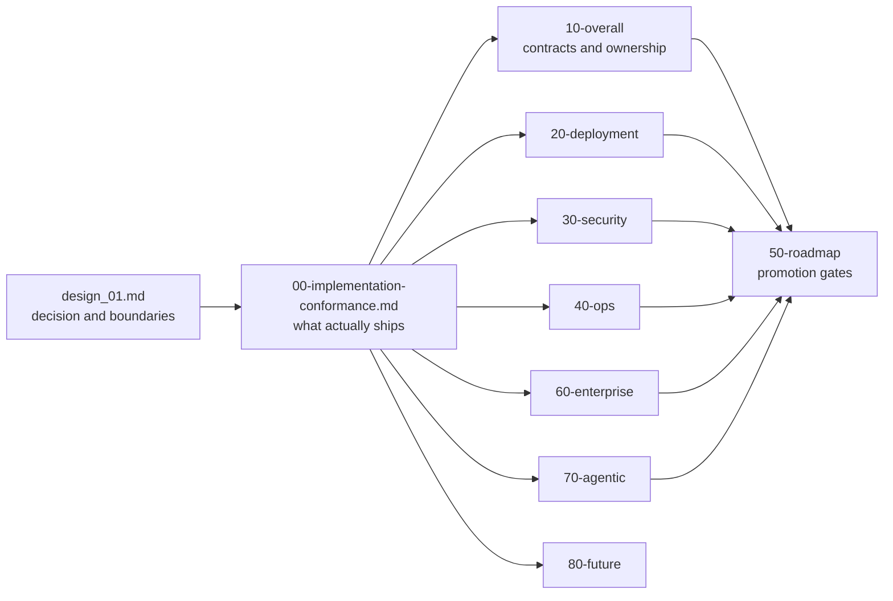

# ViewSense AI® High-Level Design

This directory is the canonical architecture set for ViewSense AI®. Read the index, then the executable
conformance map before using a target-state document as an implementation claim.

All design and product documentation is owned by `aiops-fabric-docs`. The code
repository's root README and agent instructions point here; module guides,
operations/test guides, governance prompts, and screenshots must also be authored
in this documentation repository. See the
[repository instructions](../../engineering/repository-instructions.md#documentation-ownership)
for paths and the coordinated design-sync workflow.

- [Architecture index](design_01.md) — includes the mandatory
  [platform-wide headless API requirement](design_01.md#platform-wide-headless-api-requirement)
  and capability/API/gap matrix.
- [Networking and mesh design](20-deployment/02-modular-networking-mesh.md) — replaceable CNI,
  strict workload transport and headless networking management.
- [Implementation conformance](00-implementation-conformance.md)
- [Project status and local AI integration plan](01-project-status-and-local-ai-plan.md) — current
  capabilities, missing local inference/embedding integrations, and delivery acceptance gates.
- [Local AI console and provider design](10-overall/06-local-ai-console.md) — component management,
  suite planning, separate AI/identity/certificate/observability workspaces, Tev1 decisions, real
  embeddings, pgvector migration and live RAG tests. See the
  [SSO and certificate operating guide](../../deploy/integrations/keycloak.md) for the separate
  Keycloak pod, certificate operator and detachable console startup.

Architecture changes are major changes under `docs/prompts/governance/major-change-policy.md`. They require synchronized code, contract, security, deployment, and operations updates.

The canonical deployment target is Kubernetes. Docker Compose is a developer harness and cannot be used as evidence that Kubernetes isolation, probes, storage, or policy controls work.

Enterprise SSO, observability/SIEM, governance, lifecycle, resilience, and integration requirements are consolidated in `60-enterprise/01-enterprise-integration-controls.md`.

Agent execution, governed data ingestion/chunking, and n8n or other workflow-engine integration are defined in `70-agentic/01-agent-runtime-ingestion-workflows.md`.

Trust Envelopes, provider passports, evaluation admission, safe evidence, future A2A interoperability, and sovereign cells are defined in `80-future/01-sovereign-control-evidence-fabric.md`.

Cloud model integration is represented by a credential-owning provider adapter, never by placing
vendor keys in the edge, orchestrator, or generic LLM gateway. The OpenAI reference path and its
development/production egress distinction are described across the runtime, security, deployment,
and operations documents above.
