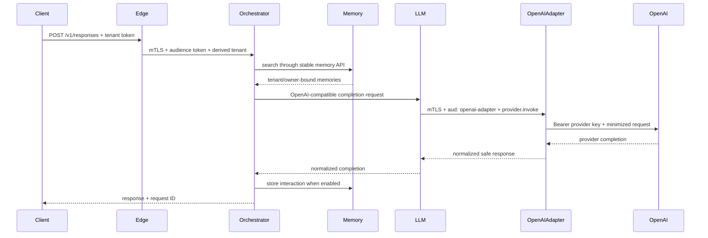
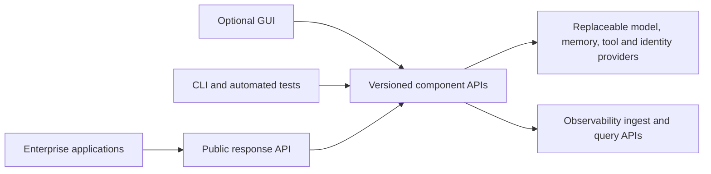

# ViewSense AI® Architecture Index

## Decision

ViewSense AI® is an API-first, Kubernetes-native sovereign AI control and evidence fabric with a small
portable reference suite. It owns portable trust envelopes, provider admission, policy, routing,
bounded agent state, safe evidence context, and stable contracts. Model, memory, workflow, identity,
policy, and MCP products remain replaceable behind those contracts.

Product packaging uses four explicit modes: `bundled`, `adapter`, `managed-dependency`, and
`external`. A bundled component is installed and tested with ViewSense AI®; an adapter is installed but
its upstream product is separate; a managed dependency is installed/operated at platform scope; an
external product is reached through an API. Product selection never implies product installation.

Application distributions use a versioned Helm chart and architecture-specific offline image
bundles. Evaluation environments are replaceable release-specific namespaces with isolated state
and credentials. Candidate environments can run in parallel; production traffic cutover requires
an independently managed entry point and an explicit state/identity/drain plan. See the
[release guide](../../releases/installation.md) and
[parallel environment design](../../releases/parallel-environments.md).

Implementation truth is maintained in
[Implementation Conformance](00-implementation-conformance.md). Target-state requirements in this
design are not evidence that a capability is deployed.

The immediate delivery objective is an enterprise harness for local AI. The
[project status and local AI integration plan](01-project-status-and-local-ai-plan.md) identifies
the local Ollama adapter, real embedding integration, versioned vector backfill and acceptance
gates. The [console design](10-overall/06-local-ai-console.md) defines the working development GUI
and its production promotion boundary.
Installed-model dropdowns support isolated decision, embedding and chat previews, followed by
explicit Save as default. An opt-in admin test contract leaves normal inference pinned and keeps
RAG retrieval on the saved embedding profile until an operator saves and backfills a new profile.
Local chat uses Ollama's native API behind the existing internal completion contract; the console
has a longer bounded preview budget for the installed Qwen model. No new hop or state owner is added.

## System boundaries

Documentation ownership is a repository boundary: `aiops-fabric` owns executable
implementation, deployment resources, runtime catalogs, and machine-readable schemas;
`aiops-fabric-docs` owns every narrative guide, architecture/design document,
conformance record, governance prompt, diagram, and documentation screenshot.
Only the implementation repo's root README and agent guidance remain as pointers.
Related code/design changes must reference their paired commits or PRs. See the
[documentation ownership rules](../../engineering/repository-instructions.md#documentation-ownership).

| Plane | Responsibility | Must not own |
|---|---|---|
| Edge | client authentication, quotas, request validation, public API | orchestration logic or provider credentials |
| Control | orchestration, routing policy, provider catalog, MCP policy | provider databases or model runtime internals |
| Provider | LLM inference, memory implementation, MCP execution | tenant authentication policy or public routing |
| Data | storage owned by exactly one service/provider | cross-service tables or direct consumer access |
| Security/operations | identity, policy decisions, secrets, telemetry, audit | business workflow semantics |
| Governance/evidence | provider passports, evaluations, admissions, safe lineage events | provider payload data or execution credentials |

## Mandatory target invariants

1. All capabilities have versioned network contracts and machine-readable schemas.
2. Each stateful domain owns its database; other domains use its API.
3. Every request is authenticated, authorized, encrypted, tenant-scoped, and traceable at every hop.
4. Provider selection is configuration/policy, never compiled into a caller.
5. An adapter must pass the same contract suite before it can replace another provider.
6. Kubernetes is the canonical packaging model; local Compose must preserve the same service boundaries.
7. A provider failure is contained by deadlines, bounded retries, circuit breaking, and no implicit
   fallback across data-residency classes. The reference implements bounded client timeouts and no
   implicit fallback; retry/circuit-breaker policy remains a production integration.

## Reference request path

This sequence shows the optional OpenAI-selected route. The deterministic regression route stops at
the LLM gateway's mock adapter and is the default after a base deployment.

## Design set

1. [Implementation conformance](00-implementation-conformance.md)
2. [Objective and principles](10-overall/01-objective-principles.md)
3. [Runtime topology and flows](10-overall/02-runtime-topology-flow.md)
4. [API and integration standards](10-overall/03-api-integration-standards.md)
5. [Component and ownership model](10-overall/04-component-breakdown.md)
6. [Operations baseline](10-overall/05-operations-and-roadmap.md)
7. [Kubernetes deployment and sizing](20-deployment/01-deployment-topology-sizing.md)
8. [Zero-trust security model](30-security/01-zero-trust.md)
9. [Day-2 operations](40-ops/01-day2-operations-sre.md)
10. [Roadmap and maturity](50-roadmap/01-roadmap-maturity.md)
11. [Enterprise integration and control matrix](60-enterprise/01-enterprise-integration-controls.md)
12. [Agent runtime, ingestion, and workflow design](70-agentic/01-agent-runtime-ingestion-workflows.md)
13. [Sovereign control and evidence fabric](80-future/01-sovereign-control-evidence-fabric.md)

## Implemented reference slice

The current code proves edge-to-orchestrator-to-memory/LLM flow, a credential-isolated OpenAI
adapter, PostgreSQL/pgvector and Mem0
memory boundaries, MCP registration and ViewSense AI® tool-provider invocation, persistent bounded
agent lifecycle, signed Trust
Envelope tenant delegation, external OIDC validation, built-in admission plus an OPA decision
boundary, append-only safe
evidence events, mTLS, scoped tokens, database ownership, provider host allow-listing, network
segmentation, and Kubernetes deployment. The OpenAI adapter is configuration-ready and its live
test requires a customer key; the deterministic mock remains the default regression provider.
When the OpenAI adapter is selected, its local default model comes from the non-secret
`config/models.env` and is currently `gpt-5.6-luna`; callers cannot override that server-controlled
route through the public request model field. Built-in provider admission is executable; OPA has an
executable decision boundary and chart sidecar but remains environment-dependent.
Keycloak and SPIRE are documented managed integrations;
their operators are not bundled. Autonomous agent workers, workflow adapters, cryptographic
third-party passport verification, immutable evidence export, full OpenTelemetry, HA, backups, and
provider certification remain roadmap work and are not represented as complete.

The local harness supports API-only startup and an independently attached GUI, with direct mTLS/
scoped-token component tests and additive binary decision probabilities. See the
[detachable API harness contract](10-overall/06-local-ai-console.md#detachable-local-api-harness).

## Platform-wide headless API requirement

**Every capability must be operable without any ViewSense AI® GUI.** A GUI is a detachable API
client, comparable to a dashboard beside its API backend. Browser sessions, view state and draft
forms are UI-owned; identity, roles, policy, model configuration, runs, knowledge, evidence and
telemetry are backend/provider-owned. No backend imports a GUI package, calls its proxy routes,
requires its cookies, or depends on its process lifetime. A CLI, automated test or another product
must be able to invoke the same versioned operations. GUI buttons cannot be the sole implementation
of a platform workflow; test-lab composition is an example API client rather than a privileged
workflow runtime. Shared OpenAPI/schema models are independent of the GUI application.

| Capability / owner | API surface | Current implementation / gap |
|---|---|---|
| Public edge / gateway | `/v1/responses` | Implemented, enterprise OIDC verifier available; local reference mTLS/token client |
| Generation / LLM gateway and adapters | `/v1/chat/completions` | Implemented mock/OpenAI/Ollama adapters; public slow-local-model route budgets need alignment |
| Judgment / Ollama adapter | `/v1/decisions`, `/v1/model-tests` | Implemented; explicit backend probabilities/favored answer; quality not certified |
| Embeddings / Ollama adapter | `/v1/embeddings`, `/v1/model-tests` | Implemented real embeddings and profile isolation |
| Model inventory / adapter | `/v1/provider-status`, `/v1/configuration` | Installed model discovery and opt-in local configuration implemented; production promotion requires governance |
| Knowledge / memory gateway | `/v1/memories`, `/v1/memories/search`, `/v1/memories:reembed` | Implemented; lifecycle/export/delete and production migration jobs remain gaps |
| Ingestion / ingestion service | `/v1/documents:ingest` | Implemented paragraph ingestion; parsing/OCR/durable job APIs remain gaps |
| Tools / MCP gateway | `/v1/servers/{name}`, `/v1/tools/call` | Implemented registry write and custom invocation; list/delete/native MCP transport remain gaps |
| Agents / agent runtime | `/v1/agent-runs`, run read/resume/cancel/events | Implemented durable lifecycle; autonomous workers remain gaps |
| Workflow execution / selected workflow provider | Versioned provider workflow/run APIs | Planned adapter; no GUI-owned workflow executor |
| Provider governance / governance | passport read/write, evaluations, `:admit` | Implemented; enforcement on runtime routes remains partial |
| Audit evidence / governance | `/v1/evidence-events` read/write | Implemented; immutable storage/export/delivery guarantees remain gaps |
| Identity / identity provider | `/oauth2/token`; enterprise OIDC/JWKS interfaces | Development grants/signing implemented; enterprise federation configuration available |
| Users, roles and memberships / enterprise IdP | Provider administration/SCIM APIs through authorized identity integration | Not implemented by the local issuer; local client-grants file is not a role-management API |
| Authorization / policy owner | Policy decision and policy lifecycle APIs | Scoped JWT checks implemented; optional OPA admission path; general RBAC/ABAC management APIs remain gaps |
| Security administration / platform and security providers | Kubernetes/RBAC/Secret APIs, IdP and policy APIs; governed rollout | Development manifests implemented; external secret/workload identity lifecycle remains gaps |
| Observability / collector and telemetry backend | ingest/export (JSON/OTLP/OpenMetrics), query/search and alert-management APIs | JSON logs, request metadata and evidence APIs implemented; native metrics/traces and query/alert integration remain gaps |
| Runtime lifecycle / Kubernetes | Kubernetes resource/status/watch APIs | Canonical full-suite deployment; local headless launcher is a development convenience |

API-first does not require one host/port per model or unsecured browser access to internal services.
Components have independent service URLs and versioned contracts; capabilities can share an adapter.
Browser credential isolation uses a thin same-origin proxy, but that proxy owns no core state or
core inference algorithm. Direct API clients use authenticated component boundaries; public clients
use the edge. Different enterprise products can expose REST, gRPC, OTLP or other documented
protocols behind these boundaries. The GUI must not add a second policy/role/database authority.

Production access management must expose authorized role/membership and policy lifecycle APIs with
least privilege, revision/concurrency checks, revocation, audit and fail-closed behavior. Do not add
an unauthenticated role editor to the development issuer. Observability must expose both ingest and
query/alert APIs via the selected enterprise backend; UI-only dashboards or file-only telemetry
configuration do not meet this requirement. Each missing surface above needs backend/API ownership,
a contract, headless conformance and negative authorization evidence before it is marked implemented.

Acceptance: launch every selected backend without a GUI; perform inference, retrieval, lifecycle,
policy/role and telemetry operations through their APIs; attach/stop/replace the GUI; repeat the
API checks unchanged. Today local model/memory/ingestion headless and Kubernetes application smoke
are executable evidence. The role/telemetry gaps and existing CNI denial failure prevent a claim
that the entire production acceptance matrix has passed.

## Modular enterprise identity and certificate control plane

Major redesign: the edge exposes versioned authentication metadata, verified user/role context,
AI component operations and certificate administration. The optional console is an OIDC client
and forwards user access tokens to the edge; authorization and tenant derivation stay in the API.
Removing the GUI leaves every backend operation available. Identity-provider users, memberships,
MFA and federation remain owned by the IdP and its administrative APIs, not a second user database.

OIDC is the provider contract. Operator-owned provider configuration pins issuer, audience, JWKS,
HTTPS authorization/token endpoints and claim-to-role-to-scope mappings. Keycloak is the POC;
Okta/generic OIDC use the same contract and require their own acceptance tests. Browser login uses
authorization code, PKCE S256, state, nonce and an HttpOnly session. Internal services continue to
accept only workload mTLS plus audience/scoped signed delegation, never browser cookies.

The certificate service owns metadata inventory and renewal requests. It reads explicitly
configured public certificates and namespaced cert-manager Certificate resources. It never reads
Kubernetes Secrets or returns PEM/private keys. cert-manager owns issuance, keys and scheduled
renewal; its API is independently operable without the console or harness. Existing development
PKI is inventoried as externally managed and is not silently replaced. Workload TLS reload and
CA trust migration require separate controlled rollout; issuing a certificate does not prove a
running workload has loaded it.

The platform management GUI adds independent Overview/suite planning, AI/models, Identity,
Certificates and Observability pages. `/v1/platform/catalog`, `/v1/platform/suites`,
`/v1/platform/status` and `/v1/platform/suite-plans` own read-only catalog/health and reproducible
plans. Plans never mutate Kubernetes; deployment apply/GitOps remains a separate planned backend.
Keycloak runs as a distinct TLS Kubernetes POC workload rather than inside the gateway or console.

## Modular networking implementation (major)

CNI and service mesh are separate replaceable cluster providers. Stable Service DNS, portable
NetworkPolicy and a provider-neutral allowed-flow contract keep application APIs independent of
Cilium/Istio. The reference uses Cilium plus Istio ambient with strict workload identity, while
application TLS/JWT/tenant checks remain mandatory. See
[networking design](20-deployment/02-modular-networking-mesh.md).

The optional host-side release preview attaches to one owned evaluation namespace through
loopback port-forwards. It uses the existing fixed-tenant smoke identity for ingestion and memory
APIs, observes service health, and retains browser session/CSRF protection. It does not provision
a cluster service or expand workload grants. See the [release preview guide](../../releases/installation.md#attach-the-host-side-release-preview-gui).

Release preview inference uses the existing gateway response API and smoke `api.invoke` grant,
then the established orchestrator/LLM/mock path. Conversation writes are disabled for that test.
Tev1/Ollama capability absence is separate from live LLM gateway health.
