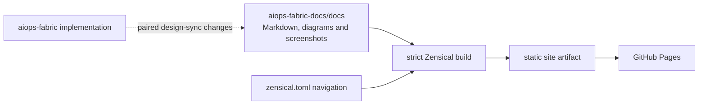

# Publishing the ViewSense AI® Documentation

All maintained documentation lives in `aiops-fabric-docs/docs/`. Zensical builds that
source directory directly; the implementation repository no longer stages or publishes
documentation. The site homepage is `docs/index.md`, while the root README describes
how to work on this documentation repository.

## Documentation ownership

- Maintain business/technical guides, architecture/design, implementation conformance,
  module guides, integration/operations/test instructions, governance prompts, diagrams,
  and documentation screenshots here.
- Keep implementation code, manifests, Helm runtime templates, catalogs, and
  machine-readable schemas in `aiops-fabric`.
- Coordinate design-impacting changes across both repositories and record paired commits
  or PRs. Follow the [repository instructions](engineering/repository-instructions.md).
- Do not add narrative documentation back to `aiops-fabric`. Its root README and agent
  guidance are pointers to the canonical documentation.
- Implementation commands shown in the guides run from the `aiops-fabric` checkout;
  documentation build and preview commands run from this checkout.

## Presentation layer

The sources remain ordinary GitHub-readable Markdown. The ViewSense AI® presentation layer uses:

- `docs/assets/stylesheets/viewsense.css` for colours, typography, homepage cards,
  tables, navigation, and light/dark styling;
- `docs/assets/images/viewsense-mark.svg` for the logo and favicon;
- `zensical.toml` for site configuration, navigation, and Markdown extensions; and
- `scripts/build-docs.sh`, `scripts/build-docs.py`, and `scripts/build-release-docs.py`
  for strict builds of the latest documentation and release snapshots.

Homepage cards originate as a normal ordered Markdown list under **Explore ViewSense AI®**.
Edit that content in `docs/index.md`; never duplicate it in generated output.



## Local build and preview

From the documentation repository root:

```sh
python3 -m venv .venv-docs
.venv-docs/bin/python -m pip install --requirement requirements-docs.txt
make docs-build
make docs-preview
```

The build helper uses the local `.venv-docs` toolchain when available, or `zensical`
from `PATH`. Open <http://127.0.0.1:8765/> and press `Ctrl-C` to stop the preview server.
Generated `site/`, caches, and virtual environments are ignored and must not be committed.

### Build-time hosting base

The tracked `zensical.toml` contains `{{DOCS_SITE_URL}}`, `{{DOCS_REPO_URL}}`, and
`{{DOCS_REPO_NAME}}` placeholders. The build fills them in an ignored `.zensical-build.toml`
inside each temporary snapshot under `.cache/`, preserving the tracked template. Zensical uses `site_url` as the
hosting base for canonical URLs and the sitemap; page and asset links remain relative.
No HTML `<base>` tag is needed.

Local builds default to `http://127.0.0.1:8765/`. To build for another domain or path:

```sh
DOCS_SITE_URL=https://docs.example.org/platform/ make docs-build
```

GitHub Actions reads the configured Pages `base_url` before building, so account,
repository, and custom-domain changes are picked up automatically on the next deployment.
Pull-request builds use the local preview base. The documentation repository link and name
come from `GITHUB_SERVER_URL` / `GITHUB_REPOSITORY` in Actions or the local Git `origin`.
Set `DOCS_REPO_URL` and `DOCS_REPO_NAME` to override that identity when needed.

The implementation repo's `make docs-build` and `make docs-preview` delegate here.
Keep sibling checkouts or set `DOCS_REPO=/absolute/path/to/aiops-fabric-docs`.
Its Docker unit/catalog targets mount `docs/` read-only for design checks rather than
copying documentation into an image. For direct implementation pytest runs, use the
sibling checkout or set `VS_DOCS_DIR=/absolute/path/to/aiops-fabric-docs/docs`.

## Documentation per application release

The header's release dropdown lists **Latest (main)** and published application versions.
Latest documentation is served under `latest/`; each release has its own path, such as
`v1.2.3/`. Switching versions keeps the equivalent page and heading when that page exists
in the selected release, and falls back to its homepage otherwise. Search stays within the
selected version. Existing documentation URLs redirect to latest and preserve query strings
and heading bookmarks.

Create a documentation tag matching each `aiops-fabric` release, for example `v1.2.3`,
after the corresponding docs are reviewed and committed. The docs tag points to the docs
commit for that application release; it need not share the application's commit hash.
Record the paired application/docs commits in the release notes. The public build reads
only this repository and does not require access to the private application repository.

From the documentation repository:

```sh
git tag -a v1.2.3 -m "Documentation for aiops-fabric v1.2.3"
git push origin v1.2.3
```

These commands illustrate a release; use the actual reviewed application version.
Tags follow `vMAJOR.MINOR.PATCH`, optionally with a prerelease suffix such as `-rc.1`.
Other tag names are excluded from the dropdown. Without release tags, only Latest appears.
Fetch all tags before previewing the full release catalog locally:

```sh
git fetch origin --tags
make docs-preview
```

Every publication builds current main plus every release tag into a single `site/` artifact.
Later main changes cannot replace a release's Markdown or assets. A tag-triggered build checks
out current main for the publishing tools and latest documentation, then reads each release's
`docs/` and `zensical.toml` from its tag. Deployment runs are serialized to keep the complete
catalog together. Preserve published tags; apply corrections as a new application/docs patch
release rather than moving an existing tag.

Each snapshot is rebuilt with the current pinned documentation toolchain and configured
hosting base; tagged content, navigation, and assets remain its own. Release tags must contain
the documentation layout and Zensical configuration. Keep the current toolchain compatible
with retained snapshots. Temporary snapshot builds live under `.cache/` and are never committed.
Run `.venv-docs/bin/python -m unittest discover -s tests` to check release-content preservation,
repeated publishing, version ordering, portable URLs, generated navigation metadata, and
retention of the previous artifact when a new build fails.

## Navigation and links

1. Edit original Markdown under `docs/`, never generated `site/` content.
2. When adding or moving a page, update its path in `zensical.toml` and all internal links.
3. Use relative links between Markdown pages and documentation assets. Paths in navigation
   are relative to `docs/`.
4. Run `make docs-build`; strict mode rejects missing navigation pages and broken links.
5. Keep implementation claims synchronized with the
   [conformance map](design/high-level/00-implementation-conformance.md).
6. Public documentation must not direct readers to the closed-source application repository.
7. Use descriptive headings without calendar dates. Identify releases or evidence baselines
   by explicit versions or commit references; use format placeholders or generated values
   for runtime timestamp examples.

## GitHub Pages deployment

The `.github/workflows/docs.yml` workflow validates documentation changes on pull requests
and publishes the `site/` artifact after relevant changes reach `main` or a release tag is pushed.
In **Settings → Pages**,
select **GitHub Actions** as the source. No Jekyll or Static HTML starter workflow is needed.
Find the deployed URL in **Settings → Pages** or the workflow's `github-pages` environment.

Manual runs are available under **Actions → Documentation → Run workflow** on `main`.
The build job needs `contents: read` and `pages: read` to obtain the configured hosting base.
The deploy job has `contents: read`,
`pages: write`, and `id-token: write` and uses the `github-pages` environment.
The implementation repo no longer contains a Pages workflow or a documentation toolchain.

## Migration record

The migration moved all 52 existing Markdown sources and 11 supporting assets from the
implementation checkout, including the latest uncommitted design edits. The documentation
layout flattens the former `docs/` prefix: architecture lives in `docs/design/`, governance
prompts in `docs/prompts/`, and the former root product overview in `docs/index.md`.
Module, contract, integration, and test guides retain their relative groupings under `docs/`.
The full implementation instructions are now `docs/engineering/repository-instructions.md`.
Management-console and synthetic status screenshots are in `docs/artifacts/` with gallery pages.
Internal links and navigation were updated for the new layout.

The generated status-preview HTML harness contains executable console implementation and
remains in the closed-source checkout; only its screenshots and written evidence are documentation.
