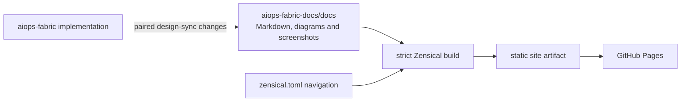

# Publishing the ViewSense AI® Documentation

All maintained documentation lives in `aiops-fabric-docs/docs/`. Zensical builds that
source directory directly; the implementation repository no longer stages or publishes
documentation. The site homepage is `docs/index.md`, while the root README describes
how to work on this documentation repository.

## Documentation ownership

- Maintain business/technical guides, architecture/design, implementation conformance,
  module guides, integration/operations/test instructions, governance prompts, diagrams,
  and documentation screenshots here.
- Keep implementation code, manifests, Helm runtime templates, catalogs, and
  machine-readable schemas in `aiops-fabric`.
- Coordinate design-impacting changes across both repositories and record paired commits
  or PRs. Follow the [repository instructions](engineering/repository-instructions.md).
- Do not add narrative documentation back to `aiops-fabric`. Its root README and agent
  guidance are pointers to the canonical documentation.
- Implementation commands shown in the guides run from the `aiops-fabric` checkout;
  documentation build and preview commands run from this checkout.

## Presentation layer

The sources remain ordinary GitHub-readable Markdown. The ViewSense AI® presentation layer uses:

- `docs/assets/stylesheets/viewsense.css` for colours, typography, homepage cards,
  tables, navigation, and light/dark styling;
- `docs/assets/images/viewsense-mark.svg` for the logo and favicon;
- `zensical.toml` for site configuration, navigation, and Markdown extensions; and
- `scripts/build-docs.sh` for a clean, strict Zensical build.

Homepage cards originate as a normal ordered Markdown list under **Explore ViewSense AI®**.
Edit that content in `docs/index.md`; never duplicate it in generated output.



## Local build and preview

From the documentation repository root:

```sh
python3 -m venv .venv-docs
.venv-docs/bin/python -m pip install --requirement requirements-docs.txt
make docs-build
make docs-preview
```

The build helper uses the local `.venv-docs` toolchain when available, or `zensical`
from `PATH`. Open <http://127.0.0.1:8765/> and press `Ctrl-C` to stop the preview server.
Generated `site/`, caches, and virtual environments are ignored and must not be committed.

The implementation repo's `make docs-build` and `make docs-preview` delegate here.
Keep sibling checkouts or set `DOCS_REPO=/absolute/path/to/aiops-fabric-docs`.
Its Docker unit/catalog targets mount `docs/` read-only for design checks rather than
copying documentation into an image. For direct implementation pytest runs, use the
sibling checkout or set `VS_DOCS_DIR=/absolute/path/to/aiops-fabric-docs/docs`.

## Navigation and links

1. Edit original Markdown under `docs/`, never generated `site/` content.
2. When adding or moving a page, update its path in `zensical.toml` and all internal links.
3. Use relative links between Markdown pages and documentation assets. Paths in navigation
   are relative to `docs/`.
4. Run `make docs-build`; strict mode rejects missing navigation pages and broken links.
5. Keep implementation claims synchronized with the
   [conformance map](design/high-level/00-implementation-conformance.md).
6. Public documentation must not direct readers to the closed-source application repository.

## GitHub Pages deployment

The `.github/workflows/docs.yml` workflow validates documentation changes on pull requests
and publishes the `site/` artifact after relevant changes reach `main`. In **Settings → Pages**,
select **GitHub Actions** as the source. No Jekyll or Static HTML starter workflow is needed.
The expected project URL is <https://diaryfolio.github.io/aiops-fabric-docs/>.

Manual runs are available under **Actions → Documentation → Run workflow** on `main`.
The build job needs repository read permission. The deploy job has `contents: read`,
`pages: write`, and `id-token: write` and uses the `github-pages` environment.
The implementation repo no longer contains a Pages workflow or a documentation toolchain.

## Migration record — 9 October 2026

The migration moved all 52 existing Markdown sources and 11 supporting assets from the
implementation checkout, including the latest uncommitted design edits. The documentation
layout flattens the former `docs/` prefix: architecture lives in `docs/design/`, governance
prompts in `docs/prompts/`, and the former root product overview in `docs/index.md`.
Module, contract, integration, and test guides retain their relative groupings under `docs/`.
The full implementation instructions are now `docs/engineering/repository-instructions.md`.
Management-console and synthetic status screenshots are in `docs/artifacts/` with gallery pages.
Internal links and navigation were updated for the new layout.

The generated status-preview HTML harness contains executable console implementation and
remains in the closed-source checkout; only its screenshots and written evidence are documentation.
