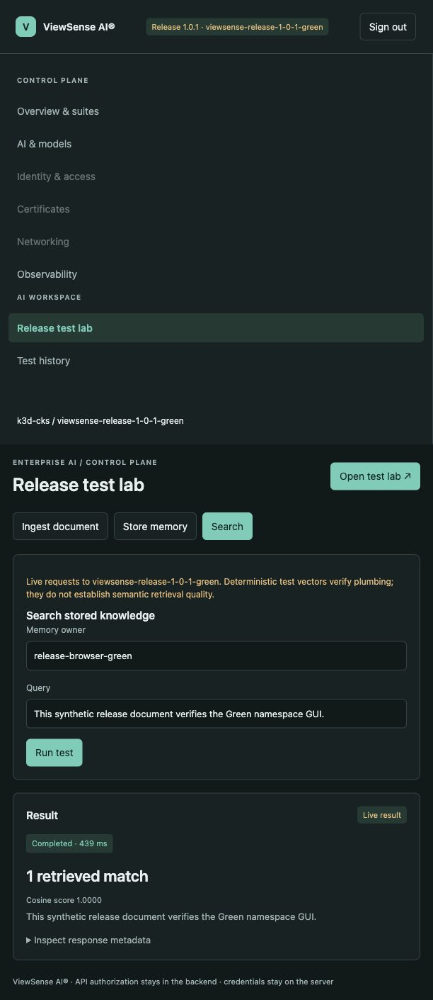
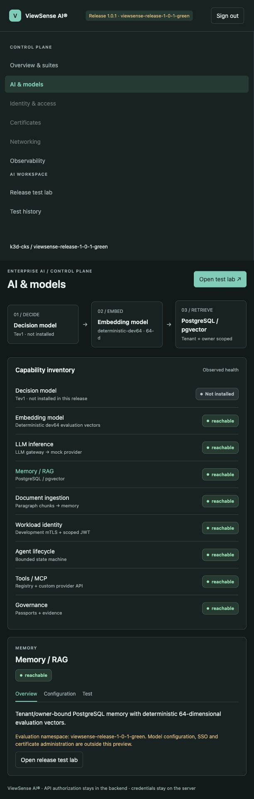
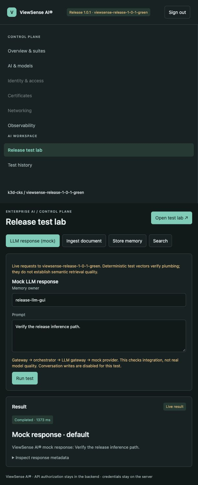

# ViewSense AI® Release Installation

Version **1.0.1** is a downloadable Kubernetes evaluation release. Use it for repeatable
installation and contract testing with the bundled mock model and tool provider. Its version
does not imply production readiness. The default suite uses a development issuer, short-lived
static mTLS certificates, deterministic embeddings and four single-replica databases.

## Distribution decision

Publish architecture-specific bundles as GitHub Release assets, accompanied by a portable
`viewsense-1.0.1.tgz` Helm chart, release notes and `SHA256SUMS`. This permits installation
without access to the application source repository or a container registry. The same chart
can later be distributed through an [OCI registry](https://docs.helm.sh/docs/v3/topics/registries/)
when an approved registry and image publication pipeline exist.

| Asset | Contents or purpose |
|---|---|
| `viewsense-1.0.1-linux-amd64.tar.gz` | x86-64 Linux node images, chart, installer and documentation snapshot |
| `viewsense-1.0.1-linux-arm64.tar.gz` | ARM64 Linux node images, chart, installer and documentation snapshot |
| `viewsense-1.0.1.tgz` | Helm chart; requires images and pre-existing Secrets |
| `release-notes-1.0.1.md` | Scope, limitations and paired source commits |
| `SHA256SUMS` | SHA-256 digests of the published assets |

Each bundle includes `images.tar` containing the application, PostgreSQL and pgvector images,
`release.json` identifying architecture and exact image IDs, an internal checksum manifest,
`offline-values.yaml`, `install.py`, helper scripts and the matching `docs/` snapshot.
Generated credentials are never packaged. The application API contract versions remain
independent of the distribution version.

## Prerequisites

- Kubernetes 1.28 or newer with ready nodes of the selected architecture, working DNS and
  an enforcing NetworkPolicy CNI. The installer rejects mixed-architecture clusters.
- A default dynamic StorageClass with at least 5 GiB for the four databases. Check the
  PV reclaim policy before treating deletion as physical erasure.
- Capacity for twelve application pods and four database pods. Default requests are approximately
  1.25 CPUs and 2.25 GiB RAM, plus the smoke Pod, cluster services and operating headroom.
- Helm 3.8+ or Helm 4, kubectl, Python 3.11+, Bash and OpenSSL on the operator workstation.
- Docker 28+ and k3d for automatic local image import, or a platform-specific image import
  procedure on every Kubernetes node. The bundle needs no upstream provider credentials.
  The k3d installer reserves the image archive size multiplied by node count plus two for import and requires
  at least 15% Docker filesystem capacity to remain free. It refuses unsafe imports rather than
  triggering node disk pressure; it never prunes unrelated images, volumes or build caches.
- Permission to create a namespace, namespaced workloads/Secrets/PVCs and to run in-pod
  connectivity probes. Upstream operators and CRDs are not installed by this bundle.

## Download and verify

Choose the asset matching **node architecture**, download it and the outer `SHA256SUMS`
from the GitHub Release, then verify before extracting. For example, on ARM64:

```sh
shasum -a 256 -c SHA256SUMS --ignore-missing
tar -xzf viewsense-1.0.1-linux-arm64.tar.gz
cd viewsense-1.0.1-linux-arm64
python3 install.py verify
```

On platforms where `shasum` does not support `--ignore-missing`, download all listed assets
and run `shasum -a 256 -c SHA256SUMS`, or verify the selected archive against its entry.
Checksums detect corruption; they do not replace signature/provenance verification.
The installer also verifies every listed bundle file before cluster operations.

## Install in a new disposable namespace

The installer requires an explicit context and a namespace beginning with
`viewsense-release-`. It refuses an existing namespace, including an existing evaluation
installation, so it cannot rotate database passwords or overwrite another installation.
One suite occupies one namespace because the chart retains fixed service names.

For the local `cks` k3d cluster:

```sh
kubectl --context k3d-cks get nodes
kubectl --context k3d-cks get storageclass
python3 install.py install --context k3d-cks \
  --namespace viewsense-release-1-0-1 --k3d-cluster cks
```

The command imports only this bundle's architecture into every k3d node, creates a restricted
namespace, generates a separate CA/signing key/client grants/database passwords in a temporary
directory, creates namespaced Secrets, then installs the packaged chart with image pulling
disabled. Temporary private material is removed after Secret creation. Existing development
PKI, credentials and workloads are not rotated by this operation.
For another namespace using the already imported artifact, replace `--k3d-cluster cks` with
`--images-preloaded` to avoid repeated Docker/image import overhead.

For another Kubernetes distribution, import `images.tar` into the Kubernetes runtime on every
node first. For a containerd node, the platform operator can use
`sudo ctr --namespace k8s.io images import images.tar`; distribution-specific tooling may differ.
Then run:

```sh
python3 install.py install --context YOUR_CONTEXT \
  --namespace viewsense-release-1-0-1 --images-preloaded
```

`--images-preloaded` is an operator assertion. `Never` pull policy fails visibly if any node
lacks the images. Running `docker load` on a workstation alone does not load remote nodes.

## Attach the host-side release preview GUI

The source checkout provides `scripts/release/console.py` as a follow-up operator utility.
It is not included in the original 1.0.1 download bundle. Install the console workstation
dependencies with `make console-deps`, then attach to an already installed reference:

```sh
make release-console RELEASE_BUNDLE=dist/releases/viewsense-1.0.1-linux-arm64 \
  RELEASE_CONTEXT=k3d-cks RELEASE_NAMESPACE=viewsense-release-1-0-1-green
```

The GUI opens at `http://127.0.0.1:8797`. It displays the exact context, namespace and release,
checks twelve live service health endpoints over mTLS, and supports a mock LLM response test,
synthetic document ingestion, memory writes and owner-bound search. The mock response goes through
gateway → orchestrator → LLM gateway → mock provider with conversation writes disabled. The
reference uses deterministic 64-dimensional test vectors, so search verifies API/storage plumbing
rather than semantic retrieval quality.
Tev1 and real Ollama chat/embedding models are not installed in this reference. The component
view distinguishes not-installed capabilities from observed service health; an unavailable or
failed probe does not remain indefinitely checking. Model configuration/previews, backfill,
SSO/certificate administration, networking plans and agent/tool/governance administration remain
outside this preview. Their live API health may
be visible without an administration workspace.

The launcher verifies the bundle and namespace ownership, then creates loopback-only Kubernetes
port-forwards. It reads only the existing smoke client's credentials and TLS material into a
private temporary directory; it does not alter namespace Secrets, issuer grants, workloads,
NetworkPolicy, databases or the local AI harness. Browser access retains launch-key/session,
Host/Origin and CSRF controls. Health checks are not NetworkPolicy enforcement evidence:
port-forward is an operator debugging path through the Kubernetes API.

Ctrl+C closes only the GUI/forwards and removes temporary credentials. Namespace data remains.
After resetting a namespace, relaunch so the GUI uses its new credentials and pod forwards.
To open Blue alongside Green, use another GUI port and a disjoint forwarding range:

```sh
make release-console RELEASE_BUNDLE=dist/releases/viewsense-1.0.1-linux-arm64 \
  RELEASE_CONTEXT=k3d-cks RELEASE_NAMESPACE=viewsense-release-1-0-1-blue \
  RELEASE_CONSOLE_ARGS='--port 8798 --base-port 28960'
```

The original `make console` continues to launch the independent local Ollama harness. It does
not attach to a release namespace. Existing `viewsense-dev` installation recovery is a separate
operator action and must preserve its credentials and state.



The component view reports Tev1 as not installed and distinguishes the installed mock inference
and deterministic embedding paths from real models:



The mock response checks the existing inference integration. An owner-bound search after this
test returned no memories, confirming that the synthetic conversation was not persisted:



## Acceptance and inspection

Installation runs `helm test` for the full mock reference and paired allowed/denied mTLS
HTTP probes. These verify authentication rejection, tenant header rejection, memory recall,
ingestion, MCP invocation, governance admission/evidence and durable agent approval/idempotency.
The policy tests require gateway → orchestrator and orchestrator → memory-gateway to work,
and gateway → ingestion and orchestrator → MCP gateway to be blocked. A DNS, certificate or
unexpected HTTP error is a failed test rather than a claimed policy denial.
Optional `--peer-namespace` tests use temporary exact transport grants, then remove them and
prove isolation again; see the [parallel simulation procedure](parallel-environments.md).

```sh
python3 install.py test --context k3d-cks --namespace viewsense-release-1-0-1
helm --kube-context k3d-cks status viewsense -n viewsense-release-1-0-1
kubectl --context k3d-cks -n viewsense-release-1-0-1 get pods,pvc
```

The default Helm smoke hook covers the full mock suite. Alternative provider profiles need
their own acceptance procedure and credentials; a skipped hook is not acceptance evidence.
The chart does not package the host-side management console, Ollama, model weights, Keycloak,
cert-manager, SPIRE or an observability stack. There is no default public ingress.

## Delete and recreate

Append a slot or simulation ID to keep multiple environments alive, for example
`viewsense-release-1-0-1-blue` and `viewsense-release-1-0-1-green`. Each has separate Secrets
and PVCs. See [parallel environments and traffic switching](parallel-environments.md).

These commands intentionally destroy the evaluation namespace and its namespaced data.
The installer checks the ownership/version label and deletes with a Kubernetes namespace UID
precondition. It refuses `viewsense-dev`, system namespaces and unowned namespaces.
Kubernetes namespace deletion removes its contained resources; see the
[namespace lifecycle guidance](https://kubernetes.io/docs/tasks/administer-cluster/namespaces/).
An external provisioner's PV reclaim policy controls retained backing storage.

```sh
# Delete, wait for removal, then install again with fresh isolated credentials.
python3 install.py reset --context k3d-cks \
  --namespace viewsense-release-1-0-1 --k3d-cluster cks

# Delete only; installation remains absent.
python3 install.py delete --context k3d-cks --namespace viewsense-release-1-0-1
```

If installation fails, inspect `kubectl ... get events` and pod logs. The owned namespace is
left available for diagnosis. Fix the cause and use `reset` to retry. A repeat `install` refuses
the existing namespace. Certificate leaves expire after seven days; reset this disposable
evaluation installation before expiry. This release does not implement in-place credential renewal.
On a resumed local k3d cluster, a ready node can still have missing CNI firewall programming.
Treat failed denial probes as a cluster security failure. The local 1.0.1 validation recovered
the affected server's rules by restarting that node and rerunning the full acceptance suite;
coordinate a node restart with its other workload owners. The installer does not restart nodes
or weaken NetworkPolicies automatically.

## Build and upload as the release owner

From the application checkout, after paired application/documentation review and commits:

```sh
make unit
make lint
make profile-check
kubectl kustomize deploy/kubernetes/base >/dev/null
make docs-build

# Default builds both node architectures; choose a fresh output directory each time.
make release-package

# Tag the exact packaged commits, even if the checkout has follow-up changes.
RELEASE_BUNDLE=dist/releases/viewsense-1.0.1-linux-arm64
RELEASE_APP_COMMIT=$(python3 -c 'import json,sys; print(json.load(open(sys.argv[1]))["source"]["application"]["commit"])' "$RELEASE_BUNDLE/release.json")
RELEASE_DOCS_COMMIT=$(python3 -c 'import json,sys; print(json.load(open(sys.argv[1]))["source"]["documentation"]["commit"])' "$RELEASE_BUNDLE/release.json")
git tag -a v1.0.1 "$RELEASE_APP_COMMIT" -m 'ViewSense AI release 1.0.1'
git -C ../aiops-fabric-docs tag -a v1.0.1 "$RELEASE_DOCS_COMMIT" -m 'ViewSense AI documentation 1.0.1'

# Push reviewed commits and matching tags to their respective repositories.
git push origin HEAD
git push origin v1.0.1
git -C ../aiops-fabric-docs push origin HEAD
git -C ../aiops-fabric-docs push origin v1.0.1

# Install/authenticate GitHub CLI first; choose the release destination's visibility.
gh auth login
make release-upload RELEASE_REPO=OWNER/REPOSITORY RELEASE_ASSETS=dist/releases

# Review the draft and its downloads before explicitly publishing.
gh release view v1.0.1 --repo OWNER/REPOSITORY --web
gh release edit v1.0.1 --repo OWNER/REPOSITORY --draft=false
```

The uploader verifies checksums and paired local tags and refuses bundles built from dirty
inputs. It creates a draft and never publishes automatically. Use `RELEASE_ARGS='--allow-dirty
--platform linux/arm64 --output dist/release-candidate'` to build a local review candidate;
rebuild from clean commits before uploading. `DOCS_REPO` supports an alternate docs checkout;
apply matching tag/push commands to that checkout.

For an application repository release, push its tag first. For a separate download repository,
ensure the application source commit is available there before using the uploader's `--target`;
this helper is intended for a release in the application repository. Private repository releases
inherit repository access; distributing to people without that access requires an approved
download repository or hosting service. Never change source-repository visibility as a release step.

## Upgrade, rollback and production promotion

This first downloadable baseline supports fresh evaluation installs and complete namespace resets.
Reset is destructive and is not a data-preserving upgrade. Helm uninstall alone can retain PVCs
and does not remove the installer-owned Secrets. Back up state before any real upgrade, retain
credentials, inspect schema compatibility and use a reviewed environment overlay. `helm rollback`
reverts Kubernetes configuration, not database migrations or external side effects.

Production promotion still requires enterprise identity, renewable workload TLS, external secrets,
signed immutable images/SBOMs/scanning/provenance, enforced policy across the complete topology,
HA databases and tested restore, ingress, scaling and protected telemetry. The packaged reference
does not satisfy those gates. See [deployment design](../design/high-level/20-deployment/01-deployment-topology-sizing.md)
and [conformance](../design/high-level/00-implementation-conformance.md).
