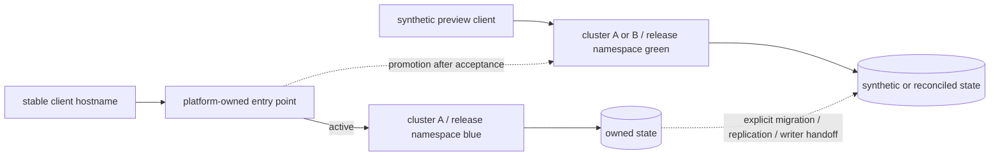

# Parallel Release Environments and Traffic Switching

Prefer immutable environment replacement: build a candidate, install it beside the active
environment, validate through a preview path, promote by switching a stable entry point,
observe and drain, then retire the old environment. Application workloads are not updated
in place during this procedure. Database compatibility and data movement still need lifecycle
work even when the application environment is replaced.

## Identity and isolation

Name each environment with its application release plus a unique slot or simulation ID:
`viewsense-release-1-0-1-blue`, `viewsense-release-1-0-1-green`, and a future
`viewsense-release-1-0-2-sim01`. Keep the public client hostname stable. Blue and green describe
deployment slots; the version and immutable artifact commit identify their contents.

| Placement | Best use | Traffic-switching owner |
|---|---|---|
| Separate namespaces in one cluster | fast application simulations and releases with the same cluster dependencies | stable cluster edge/gateway |
| Separate clusters, each with a release-specific namespace | Kubernetes, CNI, mesh, operator or cluster trust changes; strongest failure isolation | external load balancer/global edge |

Namespaces share nodes, controllers, CRDs and cluster dependencies. They are not separate
Kubernetes clusters. A fresh cluster is the safer promotion boundary for a cluster-platform
change, but takes more capacity and needs its own cluster bootstrap and acceptance. Replacing
the application alone normally does not require replacing the cluster. The 1.0.1 installer accepts
either explicit context; it does not provision or delete clusters.



## Repeatable namespace simulation

From an extracted ARM64 bundle, create both copies from the same immutable artifact:

```sh
python3 install.py install --context k3d-cks \
  --namespace viewsense-release-1-0-1-blue --k3d-cluster cks
python3 install.py install --context k3d-cks \
  --namespace viewsense-release-1-0-1-green --images-preloaded
python3 install.py test --context k3d-cks --namespace viewsense-release-1-0-1-blue \
  --peer-namespace viewsense-release-1-0-1-green
python3 install.py test --context k3d-cks --namespace viewsense-release-1-0-1-green \
  --peer-namespace viewsense-release-1-0-1-blue
```

For a future release, use its own bundle with a different release namespace. Each evaluation
copy generates independent PKI, identity grants, passwords and databases; test users and records
are synthetic. Both copies need their own capacity, PVCs and CNI acceptance. The optional peer
test checks gateway → peer identity and orchestrator → peer memory gateway connections.
It proves each path is initially denied, briefly creates exact source/destination/namespace/port
NetworkPolicy grants as a transport control, proves that the same connection works, removes the
grants and proves denial again. This supports CNI timeout or active rejection behavior while
rejecting DNS/routing failures and unavailable targets as evidence. The helper cleans up its
temporary policies on exit. Independent mTLS trust remains required throughout; this transport
test does not authorize cross-environment application calls. Do not run peer probes concurrently
against the same pair; existing probe policy names cause the second run to fail without overwrite.

## Route switching contract

A Kubernetes Service selector addresses pods within its own namespace; changing that selector
does not switch to pods in another namespace. For cross-namespace replacement, use a controller
that explicitly supports those backend references and narrowly scoped authorization. Gateway API
supports [cross-namespace routing](https://gateway-api.sigs.k8s.io/guides/user-guides/multiple-ns/);
backend references crossing namespaces require the applicable target-side ReferenceGrant.
Argo Rollouts' [blue/green service switching](https://argoproj.github.io/argo-rollouts/features/bluegreen/)
operates active/preview services in the same namespace, so it is not directly the cross-namespace
whole-suite switching model described here.

For separate clusters, configure independent upstream targets on the external edge. Prefer a
load-balancer routing change with health checks and bounded propagation over DNS-only cutover,
which is affected by caches and long-lived client connections. Route updates are not instantly
atomic across all proxies. Keep the old environment reachable during propagation and request drain.

The current gateway requires mTLS plus a release-local issuer. A production edge must preserve
verified client/workload identity and token/tenant authorization into both environments. Do not
disable certificate validation, forward a caller-selected tenant, reuse evaluation signing keys,
or treat a successful `/healthz` as end-to-end acceptance. Backend trust/SNI, client certificates,
approved cross-namespace NetworkPolicy and consistent enterprise OIDC must be designed together.
The default chart has no public ingress or cross-environment trust configuration.

Version 1.0.1 proves fresh/parallel application installs and lifecycle commands. A stable traffic
switcher remains configuration work for the chosen edge product; this release does not claim a
live production cutover. A localhost preview or port-forward is a test path, not a production
traffic switch. No new cluster-scoped edge or broad ingress exception is installed automatically.

## Production state and promotion gates

1. Record release artifact, environment ID, target context, ingress route, trust configuration,
   data owners, capacity, acceptance evidence and the current active environment.
2. Prepare state per owner: memory, MCP registry, governance and durable agent runs. For disposable
   simulations use isolated synthetic stores. For real traffic use backward-compatible managed
   stores through each owning service's configuration, or an explicit replication/restore plan
   with a writer handoff. The bundled chart currently owns four namespaced stores and does not
   implement automatic external-store cutover or state replication.
3. Validate contracts, identity/tenant negatives, enforced CNI policy, candidate data correctness,
   persistence/restart, provider behavior and sufficient capacity through the preview path.
4. Quiesce or fence writes when migrating state, reconcile versions/idempotency, pause agent workers
   and scheduled work, and ensure only one environment owns side effects. Drain existing sessions
   and requests or define their compatibility. Include IdP redirect URIs/cookies and token issuers.
5. Apply a reviewed routing change, verify the edge controller's accepted/reconciled configuration
   and measure requests reaching the candidate. Keep the old stack through an observation window.
6. Revert routing only if the old application can safely consume current state. If new writes or
   side effects are incompatible, forward recovery may be necessary; traffic reversal alone is
   not a database rollback. Preserve audit/evidence continuity.
7. Delete the old namespace or retire its cluster only after drain, successful observation,
   backup/state retention and explicit retirement authorization. Never delete shared platform
   services or active state as a routine promotion step.

See [installation and reset](installation.md),
[deployment design](../design/high-level/20-deployment/01-deployment-topology-sizing.md),
and [operations](../design/high-level/40-ops/01-day2-operations-sre.md).
